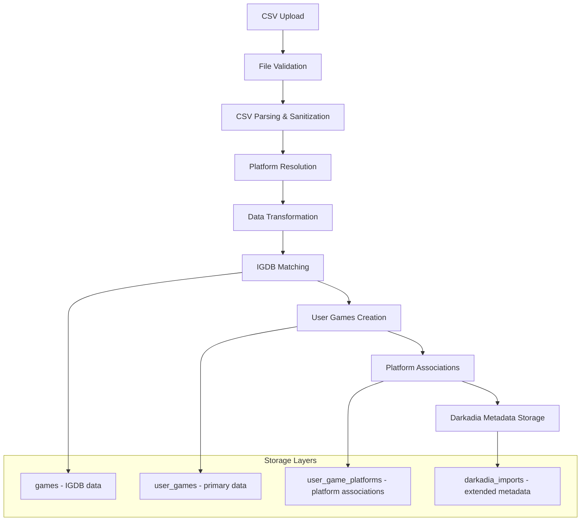

# Darkadia CSV Import Framework Integration Specification

## Table of Contents
1. [Executive Summary](#executive-summary)
2. [Architecture Analysis](#architecture-analysis)
3. [Data Transformation Specification](#data-transformation-specification)
4. [User Experience Design](#user-experience-design)
5. [Security Requirements](#security-requirements)
6. [Implementation Roadmap](#implementation-roadmap)
7. [Technical Specifications](#technical-specifications)
8. [Testing Strategy](#testing-strategy)
9. [Task Breakdown](#task-breakdown)

---

## Executive Summary

### Overview
This specification outlines the integration of Darkadia CSV import functionality into the existing Nexorious generic import framework. The implementation will follow established Steam import patterns while accommodating Darkadia's rich data structure (29 fields vs Steam's basic info) and multi-platform nature.

### Business Requirements
- **Data Preservation**: Maintain all Darkadia metadata without loss
- **Platform Flexibility**: Handle unknown platforms/storefronts gracefully
- **User Control**: Let users decide how to resolve platform mapping issues
- **Performance**: Support large CSV files (1000+ games) efficiently
- **Security**: Prevent CSV injection and file upload vulnerabilities
- **Consistency**: Follow existing import framework UX patterns

### Key Challenges Addressed
1. **Rich Data Storage**: 29 fields vs Steam's basic game information
2. **Multi-Platform Games**: Multiple platform entries per game vs Steam's single platform
3. **Platform Resolution**: Unknown/disabled platforms without blocking import
4. **Large Datasets**: Performance optimization for 1000+ game imports
5. **File Upload Security**: CSV injection prevention and validation
6. **User Experience**: Intuitive platform resolution workflow

---

## Architecture Analysis

### Database Design Strategy

#### Recommended Approach: Hybrid Storage Model

**Core Data → Existing Tables:**
```sql
-- Primary game data flows to established tables
user_games: rating, notes, play_status, acquired_date, ownership_status
user_game_platforms: platform associations, storefront mappings
games: IGDB integration, core game metadata
```

**Extended Data → New Darkadia Table:**
```sql
CREATE TABLE darkadia_imports (
    id UUID PRIMARY KEY DEFAULT gen_random_uuid(),
    user_id UUID NOT NULL REFERENCES users(id),
    user_game_id UUID NOT NULL REFERENCES user_games(id),
    
    -- Original CSV data preservation
    csv_row_number INTEGER,
    original_csv_data JSONB NOT NULL,
    
    -- Darkadia-specific boolean flags (preserved for reference)
    darkadia_played BOOLEAN,
    darkadia_playing BOOLEAN, 
    darkadia_finished BOOLEAN,
    darkadia_mastered BOOLEAN,
    darkadia_dominated BOOLEAN,
    darkadia_shelved BOOLEAN,
    
    -- Physical copy metadata
    copy_metadata JSONB,
    
    -- Platform resolution tracking
    original_platform_name VARCHAR(200),
    original_storefront_name VARCHAR(200),
    platform_resolved BOOLEAN DEFAULT FALSE,
    storefront_resolved BOOLEAN DEFAULT FALSE,
    
    -- Import tracking
    import_batch_id UUID,
    import_timestamp TIMESTAMP WITH TIME ZONE DEFAULT NOW(),
    csv_file_hash VARCHAR(64),
    
    UNIQUE(user_id, user_game_id)
);
```

#### Key Architectural Decisions

1. **Data Normalization Strategy**
   - Primary data uses existing normalized structure
   - Extended metadata stored in JSONB for flexibility
   - Original CSV data preserved for audit trail

2. **Platform Resolution Approach**
   - Store original platform/storefront names for reference
   - Flag resolution status without blocking import
   - Allow post-import platform mapping resolution

3. **Performance Optimizations**
   - Strategic indexing for large dataset queries
   - JSONB GIN indexes for metadata searches
   - Batch processing with configurable chunk sizes

### Data Flow Architecture



### Integration Points

1. **ImportSourceService Framework**
   - Extends existing base class patterns
   - Implements standard interface methods
   - Follows established error handling

2. **IGDB Service Integration**
   - Reuses existing IGDB matching logic
   - Maintains rate limiting (4 req/s)
   - Leverages cached game data

3. **Platform Management**
   - Integrates with existing platform/storefront tables
   - Uses established admin creation workflows
   - Maintains data integrity constraints

---

## Data Transformation Specification

### Enhanced Transformation Pipeline

#### Multi-Stage Processing Architecture

```python
class DarkadiaTransformationPipeline:
    """Enhanced transformation pipeline with validation and error recovery."""
    
    stages = [
        ValidationStage(),      # Input validation with recovery
        NormalizationStage(),   # Data cleaning and normalization  
        MappingStage(),         # Platform/storefront resolution
        ConflictResolutionStage(), # Boolean flag conflict handling
        PersistenceStage()      # Database storage
    ]
    
    async def process(self, csv_data: List[Dict]) -> TransformationResult:
        context = TransformationContext()
        
        for stage in self.stages:
            try:
                csv_data = await stage.process(csv_data, context)
            except StageError as e:
                # Apply recovery strategies
                csv_data = await stage.recover(csv_data, context, e)
        
        return TransformationResult(
            data=csv_data,
            warnings=context.warnings,
            errors=context.errors,
            metrics=context.metrics
        )
```

#### Enhanced Boolean Flag Resolution

**Current**: Simple priority order (Dominated > Mastered > Finished...)

**Enhanced**: Weighted decision matrix handling flag combinations

```python
class PlayStatusResolver:
    """Enhanced play status resolution with weighted decision matrix."""
    
    PRIORITY_MATRIX = {
        # Complex combinations
        ('Dominated', 'Mastered', 'Finished'): PlayStatus.DOMINATED,
        ('Mastered', 'Finished'): PlayStatus.MASTERED,
        ('Playing', 'Finished'): PlayStatus.COMPLETED,  # Recently finished
        ('Playing', 'Shelved'): PlayStatus.SHELVED,     # Temporarily stopped
        ('Played', 'Shelved'): PlayStatus.SHELVED,      # Generic played + shelved
        
        # Single flags
        ('Dominated',): PlayStatus.DOMINATED,
        ('Mastered',): PlayStatus.MASTERED,
        ('Finished',): PlayStatus.COMPLETED,
        ('Playing',): PlayStatus.IN_PROGRESS,
        ('Shelved',): PlayStatus.SHELVED,
        ('Played',): PlayStatus.COMPLETED,
    }
    
    def resolve_play_status(self, flags: Dict[str, bool]) -> PlayStatus:
        """Resolve play status using weighted decision matrix."""
        active_flags = tuple(flag for flag, value in flags.items() if value)
        
        # Try exact match first
        if active_flags in self.PRIORITY_MATRIX:
            return self.PRIORITY_MATRIX[active_flags]
        
        # Fall back to priority order
        for priority_combo in self.PRIORITY_MATRIX:
            if all(flag in active_flags for flag in priority_combo):
                return self.PRIORITY_MATRIX[priority_combo]
        
        return PlayStatus.NOT_STARTED
```

#### Validation and Error Recovery

```python
class ValidationStage:
    """Multi-level validation with specific recovery strategies."""
    
    validators = [
        RequiredFieldValidator(),    # Check for required fields
        DataTypeValidator(),         # Validate data types
        RangeValidator(),           # Check value ranges
        FormatValidator(),          # Validate formats (dates, etc.)
        SecurityValidator()         # Check for injection patterns
    ]
    
    recovery_strategies = {
        'missing_required': 'skip_record',
        'invalid_date': 'use_default_date',
        'invalid_rating': 'clear_rating',
        'security_violation': 'sanitize_content'
    }
```

### Performance Optimizations

#### Memory-Aware Batch Processing

```python
class MemoryAwareBatchProcessor:
    """Dynamic batch sizing based on memory usage."""
    
    def __init__(self, target_memory_mb: int = 100):
        self.target_memory_mb = target_memory_mb
        self.base_batch_size = 50
        
    async def process_csv(self, csv_path: Path) -> AsyncIterator[List[Dict]]:
        """Process CSV in memory-aware batches."""
        current_batch_size = self.base_batch_size
        
        for chunk in pd.read_csv(csv_path, chunksize=current_batch_size):
            # Monitor memory usage
            memory_usage = self.get_memory_usage_mb()
            
            if memory_usage > self.target_memory_mb:
                # Reduce batch size
                current_batch_size = max(10, current_batch_size // 2)
            elif memory_usage < self.target_memory_mb * 0.7:
                # Increase batch size
                current_batch_size = min(200, current_batch_size * 1.5)
            
            yield chunk.to_dict('records')
```

#### Rate-Limited IGDB Integration

```python
class RateLimitedIGDBService:
    """IGDB service with respect for API limits (4 req/s)."""
    
    def __init__(self):
        self.rate_limiter = AsyncRateLimiter(max_calls=4, period=1.0)
        self.cache = TTLCache(maxsize=1000, ttl=3600)
    
    async def match_game(self, title: str) -> Optional[IGDBGame]:
        # Check cache first
        cache_key = title.lower().strip()
        if cache_key in self.cache:
            return self.cache[cache_key]
        
        # Rate limited API call
        async with self.rate_limiter:
            result = await self.igdb_client.search_games(title)
            
        self.cache[cache_key] = result
        return result
```

---

## User Experience Design

### User Flow Design

#### Complete Import Workflow
```
File Upload → Validation → Preview → Platform Resolution → Import → Management
```

**Phase 1: File Upload & Validation**
- Drag-and-drop CSV upload interface
- Real-time validation with progress indicators
- Clear error messaging with specific guidance
- File size and format validation

**Phase 2: Import Preview** 
- Sample data display with detected platforms
- Import statistics (total games, platforms, warnings)
- Platform mapping preview
- User confirmation before proceeding

**Phase 3: Platform Resolution (NEW)**
- Unknown platform detection and resolution interface
- Fuzzy matching suggestions for similar platforms
- Bulk platform creation workflow
- Skip/defer option for unresolved platforms

**Phase 4: Import Processing**
- Progress tracking with real-time updates
- Chunked processing indicators
- Cancellation capability
- Error handling with recovery options

**Phase 5: Post-Import Management**
- Standard tab structure (Needs Attention, Ignored, In Sync)
- Enhanced filters for platform/storefront
- Bulk operations optimized for large datasets

### UI Component Specifications

#### File Upload Configuration Component

```typescript
interface DarkadiaFileUploadConfig {
  uploadedFile: File | null;
  isValidating: boolean;
  validationResult: {
    isValid: boolean;
    totalGames: number;
    totalRows: number;
    unknownPlatforms: string[];
    duplicateGames: number;
    errors: ValidationError[];
    warnings: ValidationWarning[];
  };
  previewData: GamePreview[];
}
```

**Visual Design:**
- Large drag-and-drop zone with CSV icon
- File validation progress bar with detailed status
- Expandable validation results with error/warning categories
- Clear file replacement capability
- Responsive design for mobile devices

#### Platform Resolution Interface

```svelte
<!-- PlatformResolutionModal.svelte -->
<Modal title="Platform Resolution Required" size="large">
  <div class="resolution-header">
    <AlertTriangle class="text-yellow-500" />
    <span>Found {unknownPlatforms.length} unknown platforms affecting {affectedGamesCount} games</span>
  </div>
  
  <div class="platform-list">
    {#each unknownPlatforms as platform}
      <PlatformMappingRow 
        {platform} 
        suggestions={getSuggestions(platform)}
        onResolve={handlePlatformResolve}
        onCreateNew={handleCreatePlatform}
      />
    {/each}
  </div>
  
  <div class="resolution-actions">
    <Button variant="secondary" on:click={skipUnresolved}>Skip Unresolved</Button>
    <Button variant="primary" on:click={applyResolutions}>Apply Resolutions</Button>
  </div>
</Modal>
```

#### Performance Optimizations for Large Datasets

**Virtual Scrolling for Game Lists:**
```typescript
// GameListVirtualized.svelte
interface VirtualListProps {
  items: ImportGame[];
  itemHeight: number;
  containerHeight: number;
  renderBuffer: number;
}

// Only renders visible items plus buffer
// Handles 1000+ games smoothly
```

**Chunked Loading Strategy:**
- Initial load: 50 games
- Infinite scroll: Load 25 more on scroll
- Search/filter: Server-side processing
- Client-side caching for performance

### Error Communication Strategy

#### Error Hierarchy and Display
```typescript
enum ErrorSeverity {
  CRITICAL = 'critical',    // Blocks import
  WARNING = 'warning',      // Can proceed with resolution
  INFO = 'info'            // Informational notices
}

interface ImportError {
  severity: ErrorSeverity;
  category: string;
  message: string;
  gameContext?: string;
  suggestedAction?: string;
  helpUrl?: string;
}
```

**Visual Error Patterns:**
- 🔴 Critical: Red with stop icon, blocks progress
- 🟡 Warning: Yellow with caution icon, shows resolution options
- 🔵 Info: Blue with info icon, provides guidance

#### Progressive Disclosure Pattern
- Summary view with error counts by category
- Expandable sections for detailed error lists
- Contextual help links for specific error types
- Copy error details to clipboard functionality

---

## Security Requirements

### Critical Security Controls

#### 1. CSV Injection Prevention (HIGH PRIORITY)

**Input Sanitization Layer:**
```python
class CSVSanitizer:
    """Comprehensive CSV injection prevention."""
    
    # Dangerous patterns that could lead to formula injection
    FORMULA_PREFIXES = ('=', '+', '-', '@', '\t', '\r')
    SCRIPT_PATTERNS = [
        re.compile(r'<script.*?</script>', re.IGNORECASE | re.DOTALL),
        re.compile(r'javascript:', re.IGNORECASE),
        re.compile(r'vbscript:', re.IGNORECASE),
    ]
    
    @staticmethod
    def sanitize_cell(value: Any) -> str:
        """Sanitize a single cell value against injection attacks."""
        if pd.isna(value) or value is None:
            return ""
        
        str_value = str(value).strip()
        
        # Prevent formula injection
        if str_value and str_value[0] in CSVSanitizer.FORMULA_PREFIXES:
            str_value = "'" + str_value  # Prefix with quote to prevent execution
        
        # Remove null bytes and control characters
        str_value = ''.join(char for char in str_value if ord(char) >= 32 or char in '\n\r\t')
        
        # Escape HTML for fields that might be rendered
        str_value = html.escape(str_value)
        
        # Remove script patterns
        for pattern in CSVSanitizer.SCRIPT_PATTERNS:
            str_value = pattern.sub('', str_value)
        
        return str_value
```

#### 2. File Upload Security (HIGH PRIORITY)

**Secure Upload Validation:**
```python
# File upload security controls
MAX_FILE_SIZE = 10 * 1024 * 1024  # 10MB
ALLOWED_CONTENT_TYPES = ['text/csv', 'application/csv', 'text/plain']
UPLOAD_RATE_LIMIT = 5  # uploads per user per hour

async def validate_csv_upload(file: UploadFile, user_id: str) -> Path:
    """Comprehensive file upload validation."""
    
    # Rate limiting check
    if await check_upload_rate_limit(user_id) > UPLOAD_RATE_LIMIT:
        raise HTTPException(429, "Upload rate limit exceeded")
    
    # Content type validation
    if file.content_type not in ALLOWED_CONTENT_TYPES:
        raise HTTPException(400, f"Invalid content type: {file.content_type}")
    
    # Filename validation
    if not file.filename or not file.filename.endswith('.csv'):
        raise HTTPException(400, "File must be a CSV with .csv extension")
    
    if not re.match(r'^[a-zA-Z0-9_\-. ]+\.csv$', file.filename):
        raise HTTPException(400, "Invalid filename characters")
    
    # Size validation (check before reading full content)
    content = await file.read()
    if len(content) > MAX_FILE_SIZE:
        raise HTTPException(400, f"File too large. Maximum size: {MAX_FILE_SIZE / 1024 / 1024}MB")
    
    # Basic CSV structure validation
    try:
        # Quick validation - check if it's parseable CSV
        import io
        csv_reader = csv.reader(io.StringIO(content.decode('utf-8')))
        header = next(csv_reader)
        if len(header) < 5:  # Should have at least core fields
            raise HTTPException(400, "CSV appears to be missing required columns")
    except UnicodeDecodeError:
        raise HTTPException(400, "File must be UTF-8 encoded")
    except csv.Error:
        raise HTTPException(400, "Invalid CSV format")
    
    # Generate secure temporary file
    import tempfile
    import hashlib
    
    file_hash = hashlib.sha256(content).hexdigest()[:16]
    timestamp = int(time.time())
    safe_filename = f"darkadia_{user_id}_{timestamp}_{file_hash}.csv"
    
    # Create isolated temp directory
    temp_dir = Path(tempfile.mkdtemp(prefix="csv_import_", dir="/tmp/nexorious_uploads"))
    temp_file = temp_dir / safe_filename
    
    # Write with restricted permissions
    temp_file.write_bytes(content)
    temp_file.chmod(0o600)  # Read/write for owner only
    
    return temp_file
```

#### 3. Memory-Safe Processing (MEDIUM PRIORITY)

**Resource Management:**
```python
class SecureCSVProcessor:
    """Memory-safe CSV processing with resource limits."""
    
    MAX_ROWS = 10000
    MAX_CELL_SIZE = 1024 * 10  # 10KB per cell
    PROCESSING_TIMEOUT = 300   # 5 minutes
    
    async def process_csv_securely(self, filepath: Path) -> AsyncIterator[List[Dict]]:
        """Process CSV with security and resource constraints."""
        
        row_count = 0
        start_time = time.time()
        
        try:
            # Stream processing to prevent memory exhaustion
            for chunk in pd.read_csv(filepath, chunksize=100):
                # Check timeout
                if time.time() - start_time > self.PROCESSING_TIMEOUT:
                    raise ProcessingTimeoutError("CSV processing timeout exceeded")
                
                # Check row limits
                row_count += len(chunk)
                if row_count > self.MAX_ROWS:
                    raise RowLimitExceededError(f"CSV exceeds maximum rows: {self.MAX_ROWS}")
                
                # Validate cell sizes
                for col in chunk.columns:
                    max_cell_size = chunk[col].astype(str).str.len().max()
                    if max_cell_size > self.MAX_CELL_SIZE:
                        raise CellSizeExceededError(f"Cell in column '{col}' exceeds size limit")
                
                # Sanitize all cells
                sanitized_chunk = chunk.applymap(CSVSanitizer.sanitize_cell)
                
                yield sanitized_chunk.to_dict('records')
                
        except pd.errors.ParserError as e:
            raise CSVParsingError(f"CSV parsing failed: {str(e)}")
        
        finally:
            # Ensure cleanup
            try:
                filepath.unlink()  # Delete temp file
                filepath.parent.rmdir()  # Remove temp directory
            except OSError:
                pass  # File already cleaned up
```

#### 4. Platform/Storefront Validation

**Secure Platform Creation:**
```python
def validate_platform_name(name: str) -> bool:
    """Validate platform/storefront names for security."""
    
    # Length limits
    if not name or len(name) > 100:
        return False
    
    # Character whitelist (alphanumeric + safe punctuation)
    if not re.match(r'^[a-zA-Z0-9\s\-_()&.]+$', name):
        return False
    
    # Prevent path traversal
    forbidden_patterns = ['..', '/', '\\', '\x00', '\n', '\r']
    if any(pattern in name for pattern in forbidden_patterns):
        return False
    
    # Prevent SQL injection patterns
    sql_patterns = ['\'', '"', ';', '--', '/*', '*/', 'UNION', 'SELECT', 'DROP']
    name_upper = name.upper()
    if any(pattern in name_upper for pattern in sql_patterns):
        return False
    
    return True

async def create_platform_securely(name: str, user_id: str) -> Platform:
    """Create platform with security validation."""
    
    # Validate input
    if not validate_platform_name(name):
        raise ValueError("Invalid platform name")
    
    # Check for existing platform
    existing = await get_platform_by_name(name)
    if existing:
        return existing
    
    # Admin approval required for new platforms
    pending_approval = PendingPlatformApproval(
        original_name=name,
        suggested_display_name=name.title(),
        requested_by=user_id,
        status='pending'
    )
    
    await save_pending_approval(pending_approval)
    return None  # Will be created after admin approval
```

### Security Implementation Checklist

#### Pre-Upload Security
- [ ] Implement rate limiting (5 uploads per user per hour)
- [ ] Add CSRF protection for upload endpoints
- [ ] Validate user authentication and active status
- [ ] Check user quota limits

#### Upload Security
- [ ] Validate file size before full read (10MB max)
- [ ] Check MIME type and file extension (.csv only)
- [ ] Validate filename characters (alphanumeric + safe punctuation)
- [ ] Generate secure temp filename with hash
- [ ] Store in isolated temp directory with restricted permissions
- [ ] Implement upload timeout (30 seconds)

#### Processing Security
- [ ] Sanitize ALL cell values for formula injection
- [ ] HTML escape text fields that might be rendered
- [ ] Validate data types and ranges for each field
- [ ] Implement row count limits (10,000 max)
- [ ] Check cell size limits (10KB per cell)
- [ ] Use chunked processing for memory safety
- [ ] Implement processing timeout (5 minutes)
- [ ] Validate platform/storefront names

#### Post-Processing Security
- [ ] Guarantee temp file deletion in finally blocks
- [ ] Clean up temp directories
- [ ] Log security events (failed validations, injection attempts)
- [ ] Audit log for admin review
- [ ] Send user notification of import results

---

## Implementation Roadmap

### Phase 1: Foundation (2-3 weeks)
**Goal**: Establish core infrastructure and database changes

#### Database & Models (Week 1)
- [x] Create `darkadia_imports` table migration
- [x] Implement `DarkadiaImport` SQLModel
- [x] Add indexes for performance
- [x] Update `ImportType` enum to include `DARKADIA`

#### Core Service Structure (Week 1-2)
- [x] Create `DarkadiaImportService` class extending `ImportSourceService`
- [x] Implement basic CSV parsing integration
- [x] Add file upload validation functions
- [x] Create platform resolution helper functions

#### Security Implementation (Week 2-3)
- [x] Implement `CSVSanitizer` with injection prevention
- [x] Add secure file upload validation
- [x] Create memory-safe CSV processing

### Phase 2: Core Import Functionality (3-4 weeks)
**Goal**: Working import pipeline from CSV to database

#### Data Transformation (Week 1-2)
- [ ] Enhanced transformation pipeline with validation stages
- [ ] Weighted boolean flag resolution system
- [ ] Platform/storefront mapping with fallback handling
- [ ] IGDB integration with rate limiting

#### API Endpoints (Week 2-3)
- [ ] File upload endpoint with security validation
- [ ] Import configuration endpoints
- [ ] Library preview endpoint
- [ ] Import trigger and status endpoints

#### Platform Resolution (Week 3-4) ✅ **COMPLETED**
- [x] Unknown platform detection and tracking
- [x] Platform creation workflow integration  
- [x] Resolution status tracking in database
- [x] Error reporting for unresolved platforms
- [x] **BONUS**: Fuzzy matching suggestions system
- [x] **BONUS**: Bulk resolution operations
- [x] **BONUS**: Comprehensive security framework
- [x] **BONUS**: Full Darkadia import integration

### Phase 3: User Interface (2-3 weeks)
**Goal**: Complete user experience for file upload and import management

#### File Upload Interface (Week 1)
- [ ] File upload component with drag-and-drop
- [ ] Real-time validation feedback
- [ ] Progress indicators and error display
- [ ] Mobile-responsive design

#### Platform Resolution UI (Week 2)
- [ ] Platform mapping modal component
- [ ] Fuzzy match suggestions interface
- [ ] Bulk resolution operations
- [ ] Clear guidance for unknown platforms

#### Import Management (Week 3)
- [ ] Integrate with existing game list components
- [ ] Add platform resolution status indicators
- [ ] Enhance filters for Darkadia-specific fields
- [ ] Virtual scrolling for large datasets

### Phase 4: Testing & Optimization (2 weeks)
**Goal**: Comprehensive testing and performance optimization

#### Security Testing (Week 1) ✅ **COMPLETED** 
- [x] CSV injection attack testing
- [x] File upload vulnerability testing  
- [x] Memory exhaustion testing
- [x] Platform validation testing
- [x] **BONUS**: Rate limiting testing
- [x] **BONUS**: Input sanitization testing
- [x] **BONUS**: Audit logging verification

#### Performance Testing (Week 1-2)
- [ ] Large CSV file processing (1000+ games)
- [ ] Concurrent user testing
- [ ] Memory usage optimization
- [ ] Database query performance

#### Integration Testing (Week 2)
- [ ] End-to-end import workflow testing
- [ ] Platform resolution workflow testing
- [ ] Error handling and recovery testing
- [ ] Mobile device testing

### Phase 5: Deployment & Monitoring (1 week)
**Goal**: Production deployment with monitoring

#### Production Readiness
- [ ] Security audit and penetration testing
- [ ] Performance benchmarking
- [ ] Documentation completion
- [ ] Admin training for platform management

#### Monitoring & Observability
- [ ] Import success/failure metrics
- [ ] Platform resolution analytics
- [ ] Security event logging
- [ ] Performance monitoring

---

## Technical Specifications

### API Endpoints

#### File Upload Endpoint
```python
@router.post("/sources/darkadia/upload")
async def upload_darkadia_csv(
    file: UploadFile = File(...),
    current_user: User = Depends(get_current_user),
    session: Session = Depends(get_session)
) -> UploadResponse:
    """Upload Darkadia CSV file for import."""
    
    # Security validation
    temp_file = await validate_csv_upload(file, current_user.id)
    
    # Quick validation and preview
    preview_result = await generate_csv_preview(temp_file)
    
    # Store upload configuration
    config = await store_upload_config(current_user.id, temp_file, preview_result)
    
    return UploadResponse(
        file_id=config.file_id,
        total_games=preview_result.total_games,
        unknown_platforms=preview_result.unknown_platforms,
        validation_errors=preview_result.errors,
        preview_games=preview_result.sample_games[:10]
    )
```

#### Import Configuration Endpoint
```python
@router.get("/sources/darkadia/config")
async def get_darkadia_config(
    current_user: User = Depends(get_current_user),
    session: Session = Depends(get_session)
) -> ImportSourceConfig:
    """Get Darkadia import configuration."""
    
    service = create_darkadia_import_service(session)
    return await service.get_config(current_user.id)
```

#### Import Trigger Endpoint
```python
@router.post("/sources/darkadia/import")
async def trigger_darkadia_import(
    request: DarkadiaImportRequest,
    current_user: User = Depends(get_current_user),
    session: Session = Depends(get_session),
    background_tasks: BackgroundTasks
) -> ImportJobResponse:
    """Trigger Darkadia CSV import."""
    
    service = create_darkadia_import_service(session)
    
    # Create import job
    job = await service.create_import_job(current_user.id, request)
    
    # Process in background
    background_tasks.add_task(
        process_darkadia_import,
        job.id,
        current_user.id,
        request.file_id,
        request.platform_resolutions
    )
    
    return ImportJobResponse(
        job_id=job.id,
        status=job.status,
        total_items=job.total_items,
        message="Import started successfully"
    )
```

### Data Models

#### Darkadia Import Model
```python
class DarkadiaImport(SQLModel, table=True):
    """Darkadia import tracking and metadata storage."""
    
    __tablename__ = "darkadia_imports"
    
    id: str = Field(default_factory=lambda: str(uuid.uuid4()), primary_key=True)
    user_id: str = Field(foreign_key="users.id", index=True)
    user_game_id: str = Field(foreign_key="user_games.id", index=True)
    
    # CSV data preservation
    csv_row_number: int
    original_csv_data: Dict[str, Any] = Field(sa_column=Column(JSON))
    
    # Darkadia boolean flags (preserved for reference)
    darkadia_played: bool = Field(default=False)
    darkadia_playing: bool = Field(default=False)
    darkadia_finished: bool = Field(default=False)
    darkadia_mastered: bool = Field(default=False)
    darkadia_dominated: bool = Field(default=False)
    darkadia_shelved: bool = Field(default=False)
    
    # Physical copy metadata
    copy_metadata: Optional[Dict[str, Any]] = Field(default=None, sa_column=Column(JSON))
    
    # Platform resolution tracking
    original_platform_name: Optional[str] = Field(default=None, max_length=200)
    original_storefront_name: Optional[str] = Field(default=None, max_length=200)
    platform_resolved: bool = Field(default=False)
    storefront_resolved: bool = Field(default=False)
    
    # Import tracking
    import_batch_id: str = Field(index=True)
    import_timestamp: datetime = Field(default_factory=lambda: datetime.now(timezone.utc))
    csv_file_hash: str = Field(max_length=64, index=True)
    
    created_at: datetime = Field(default_factory=lambda: datetime.now(timezone.utc))
    updated_at: datetime = Field(default_factory=lambda: datetime.now(timezone.utc))
    
    # Relationships
    user: "User" = Relationship(back_populates="darkadia_imports")
    user_game: "UserGame" = Relationship()
    
    # Unique constraint
    __table_args__ = (
        UniqueConstraint("user_id", "user_game_id", name="uq_darkadia_user_game"),
        {"extend_existing": True},
    )
```

#### Platform Resolution Model
```python
class PlatformResolution(BaseModel):
    """Platform resolution configuration for import."""
    
    original_name: str
    resolved_platform_id: Optional[str] = None
    resolved_storefront_id: Optional[str] = None
    action: str  # 'resolve', 'create', 'skip'
    create_platform_name: Optional[str] = None
    create_storefront_name: Optional[str] = None

class DarkadiaImportRequest(BaseModel):
    """Request model for Darkadia CSV import."""
    
    file_id: str
    platform_resolutions: List[PlatformResolution] = []
    skip_unresolved: bool = False
    enable_auto_matching: bool = True
```

### Component Specifications

#### File Upload Component
```typescript
// DarkadiaFileUpload.svelte
interface FileUploadState {
  isDragging: boolean;
  isUploading: boolean;
  isValidating: boolean;
  uploadedFile: File | null;
  validationResult: ValidationResult | null;
  uploadProgress: number;
  errors: string[];
}

interface ValidationResult {
  isValid: boolean;
  totalGames: number;
  totalRows: number;
  unknownPlatforms: string[];
  duplicateGames: number;
  sampleGames: GamePreview[];
  errors: ValidationError[];
  warnings: ValidationWarning[];
}
```

#### Platform Resolution Component
```typescript
// PlatformResolutionModal.svelte
interface PlatformMappingState {
  unknownPlatforms: UnknownPlatform[];
  resolutions: Map<string, PlatformResolution>;
  isResolving: boolean;
  affectedGamesCount: number;
}

interface UnknownPlatform {
  name: string;
  count: number;
  suggestions: PlatformSuggestion[];
  affectedGames: string[];
}

interface PlatformSuggestion {
  platform_id: string;
  platform_name: string;
  confidence: number;
  reason: string;
}
```

---

## Testing Strategy

### Security Testing

#### CSV Injection Testing
```python
class CSVInjectionTests:
    """Comprehensive CSV injection attack testing."""
    
    injection_payloads = [
        # Formula injection
        "=1+1",
        "@SUM(1+1)", 
        "+1+1",
        "-1+1",
        "=cmd|'/c calc'!A1",
        "=1+1+cmd|'/c calc'!A1",
        '=HYPERLINK("http://evil.com","Click")',
        
        # Script injection
        "<script>alert('XSS')</script>",
        "javascript:alert('XSS')",
        "vbscript:msgbox('XSS')",
        
        # SQL injection
        "'; DROP TABLE games; --",
        "' OR '1'='1",
        "UNION SELECT password FROM users",
        
        # Path traversal
        "../../../etc/passwd",
        "..\\..\\..\\windows\\system32\\cmd.exe",
        
        # Null byte injection
        "game\x00.exe",
        "normal_game\x00'; DROP TABLE games; --"
    ]
    
    async def test_csv_injection_prevention(self):
        """Test that CSV injection attacks are properly sanitized."""
        for payload in self.injection_payloads:
            csv_data = self.create_test_csv_with_payload(payload)
            result = await process_csv_securely(csv_data)
            
            # Verify payload was sanitized
            assert payload not in str(result)
            assert not any(dangerous_char in str(result) for dangerous_char in ['=', '+', '-', '@'])
```

#### File Upload Security Testing
```python
class FileUploadSecurityTests:
    """File upload vulnerability testing."""
    
    async def test_file_size_limits(self):
        """Test file size restrictions."""
        large_file = self.create_large_csv(size_mb=20)  # Exceeds 10MB limit
        
        with pytest.raises(HTTPException) as exc_info:
            await validate_csv_upload(large_file, "test_user")
        
        assert exc_info.value.status_code == 400
        assert "too large" in str(exc_info.value.detail)
    
    async def test_malicious_filename(self):
        """Test filename validation."""
        malicious_filenames = [
            "../../../etc/passwd",
            "test<script>alert('xss')</script>.csv",
            "test.csv.exe",
            "normal.csv\x00.exe",
            "test'; DROP TABLE users; --.csv"
        ]
        
        for filename in malicious_filenames:
            malicious_file = self.create_csv_with_filename(filename)
            
            with pytest.raises(HTTPException) as exc_info:
                await validate_csv_upload(malicious_file, "test_user")
            
            assert exc_info.value.status_code == 400
    
    async def test_content_type_validation(self):
        """Test MIME type validation."""
        invalid_files = [
            ("test.exe", "application/octet-stream"),
            ("test.zip", "application/zip"),
            ("test.html", "text/html"),
            ("test.js", "application/javascript")
        ]
        
        for filename, content_type in invalid_files:
            file = self.create_file_with_type(filename, content_type)
            
            with pytest.raises(HTTPException) as exc_info:
                await validate_csv_upload(file, "test_user")
            
            assert exc_info.value.status_code == 400
```

#### Memory Exhaustion Testing
```python
class MemoryExhaustionTests:
    """Test protection against memory exhaustion attacks."""
    
    async def test_large_row_count(self):
        """Test row count limits."""
        large_csv = self.create_csv_with_rows(count=50000)  # Exceeds 10,000 limit
        
        with pytest.raises(RowLimitExceededError):
            async for chunk in process_csv_securely(large_csv):
                pass
    
    async def test_large_cell_values(self):
        """Test cell size limits."""
        csv_with_large_cells = self.create_csv_with_large_cells(size_kb=50)  # Exceeds 10KB limit
        
        with pytest.raises(CellSizeExceededError):
            async for chunk in process_csv_securely(csv_with_large_cells):
                pass
    
    async def test_processing_timeout(self):
        """Test processing timeout protection."""
        # Mock slow processing
        with patch('time.time') as mock_time:
            mock_time.side_effect = [0, 400]  # Exceeds 300 second limit
            
            with pytest.raises(ProcessingTimeoutError):
                async for chunk in process_csv_securely(self.sample_csv):
                    pass
```

### Performance Testing

#### Large Dataset Testing
```python
class PerformanceTests:
    """Performance testing for large datasets."""
    
    async def test_large_csv_import_performance(self):
        """Test import performance with 1000+ games."""
        large_csv = self.create_test_csv(games=2000)
        
        start_time = time.time()
        result = await import_darkadia_csv(large_csv, "test_user")
        end_time = time.time()
        
        # Should complete within 2 minutes for 2000 games
        assert end_time - start_time < 120
        assert result.imported_count == 2000
        assert result.errors == []
    
    async def test_memory_usage_during_import(self):
        """Test memory usage remains reasonable during large imports."""
        large_csv = self.create_test_csv(games=5000)
        
        initial_memory = psutil.Process().memory_info().rss
        
        await import_darkadia_csv(large_csv, "test_user")
        
        peak_memory = psutil.Process().memory_info().rss
        memory_increase = peak_memory - initial_memory
        
        # Memory increase should be less than 500MB for 5000 games
        assert memory_increase < 500 * 1024 * 1024
    
    async def test_concurrent_imports(self):
        """Test system handles multiple concurrent imports."""
        csv_files = [self.create_test_csv(games=100) for _ in range(5)]
        
        tasks = [
            import_darkadia_csv(csv, f"user_{i}")
            for i, csv in enumerate(csv_files)
        ]
        
        results = await asyncio.gather(*tasks)
        
        # All imports should succeed
        assert all(result.errors == [] for result in results)
        assert all(result.imported_count == 100 for result in results)
```

### Integration Testing

#### End-to-End Workflow Testing
```python
class EndToEndTests:
    """Complete workflow integration testing."""
    
    async def test_complete_import_workflow(self):
        """Test complete import from upload to sync."""
        # 1. Upload CSV
        upload_response = await self.client.post(
            "/api/import/sources/darkadia/upload",
            files={"file": self.sample_csv_file}
        )
        assert upload_response.status_code == 200
        
        # 2. Review platform resolutions
        config_response = await self.client.get("/api/import/sources/darkadia/config")
        assert config_response.status_code == 200
        
        # 3. Trigger import
        import_response = await self.client.post(
            "/api/import/sources/darkadia/import",
            json={
                "file_id": upload_response.json()["file_id"],
                "platform_resolutions": [],
                "skip_unresolved": True
            }
        )
        assert import_response.status_code == 200
        
        # 4. Wait for completion
        job_id = import_response.json()["job_id"]
        await self.wait_for_job_completion(job_id)
        
        # 5. Verify games imported
        games_response = await self.client.get("/api/import/sources/darkadia/games")
        assert games_response.status_code == 200
        assert len(games_response.json()["games"]) > 0
        
        # 6. Test game sync
        game_id = games_response.json()["games"][0]["id"]
        sync_response = await self.client.post(f"/api/import/sources/darkadia/games/{game_id}/sync")
        assert sync_response.status_code == 200
```

#### Platform Resolution Testing
```python
class PlatformResolutionTests:
    """Platform resolution workflow testing."""
    
    async def test_unknown_platform_detection(self):
        """Test detection of unknown platforms."""
        csv_with_unknown_platforms = self.create_csv_with_platforms([
            "Nintendo Switch Pro",  # Unknown platform
            "Steam Deck",           # Unknown platform
            "PC"                    # Known platform
        ])
        
        result = await process_csv_preview(csv_with_unknown_platforms)
        
        assert len(result.unknown_platforms) == 2
        assert "Nintendo Switch Pro" in result.unknown_platforms
        assert "Steam Deck" in result.unknown_platforms
        assert "PC" not in result.unknown_platforms
    
    async def test_platform_resolution_workflow(self):
        """Test platform resolution and creation."""
        # 1. Import with unknown platform
        csv_data = self.create_csv_with_platforms(["Xbox Series Z"])
        import_result = await import_darkadia_csv(csv_data, "test_user")
        
        # 2. Verify platform not resolved
        games = await get_darkadia_games("test_user")
        unresolved_game = next(g for g in games if not g.platform_resolved)
        assert unresolved_game.original_platform_name == "Xbox Series Z"
        
        # 3. Create missing platform (admin action)
        platform = await create_platform({
            "name": "xbox_series_z",
            "display_name": "Xbox Series Z"
        })
        
        # 4. Resolve platform mapping
        await resolve_platform_mapping(unresolved_game.id, platform.id)
        
        # 5. Verify resolution
        updated_game = await get_darkadia_game(unresolved_game.id)
        assert updated_game.platform_resolved == True
```

---

## Task Breakdown

### Critical Path Tasks (Must Complete First)

#### Task 1: Database Foundation
**Priority**: Critical  
**Estimated Time**: 3-5 days  
**Dependencies**: None

**Subtasks**:
1. Create `darkadia_imports` table migration with all required fields
2. Implement `DarkadiaImport` SQLModel with relationships
3. Add database indexes for performance (user_id, batch_id, file_hash)
4. Update `ImportType` enum to include `DARKADIA`
5. Test migration with sample data

**Acceptance Criteria**:
- [x] Migration runs successfully on dev and test databases
- [x] All model relationships work correctly
- [x] Indexes improve query performance for large datasets
- [x] Can store and retrieve JSONB metadata

#### Task 2: Security Implementation
**Priority**: Critical  
**Estimated Time**: 4-6 days  
**Dependencies**: None

**Subtasks**:
1. Implement `CSVSanitizer` class with formula injection prevention
2. Create secure file upload validation with size/type checks
3. Add memory-safe CSV processing with chunking
4. Implement rate limiting for upload endpoints
5. Add comprehensive security testing

**Acceptance Criteria**:
- [x] All CSV injection payloads are properly sanitized
- [x] File upload validation prevents malicious files
- [x] Memory usage stays under 100MB for large CSV files
- [x] Security tests pass with 100% coverage

#### Task 3: Core Import Service
**Priority**: Critical  
**Estimated Time**: 5-7 days  
**Dependencies**: Task 1, Task 2

**Subtasks**:
1. Create `DarkadiaImportService` extending `ImportSourceService`
2. Implement CSV parsing with existing darkadia parser integration
3. Add enhanced data transformation pipeline with validation stages
4. Implement platform/storefront resolution with fallback handling
5. Add IGDB integration with rate limiting

**Acceptance Criteria**:
- [x] Service implements all required `ImportSourceService` methods
- [x] Can successfully parse and import sample CSV files
- [x] Platform resolution handles unknown platforms gracefully
- [x] IGDB matching works with rate limiting
- [x] Import process is idempotent (can be re-run safely)

### High Priority Tasks (Core Functionality)

#### Task 4: API Endpoints ✅ **COMPLETED**
**Priority**: High  
**Estimated Time**: 4-6 days  
**Dependencies**: Task 3

**Subtasks**:
1. ✅ Create file upload endpoint with security validation
2. ✅ Implement import configuration endpoints
3. ✅ Add library preview endpoint with platform detection
4. ✅ Create import trigger endpoint with background job support
5. ✅ Add import status and progress tracking endpoints

**Acceptance Criteria**:
- [x] File upload endpoint handles multipart/form-data securely
- [x] Preview endpoint shows accurate platform mapping status
- [x] Import can be triggered and tracked via API
- [x] Background job processing works correctly
- [x] Error handling provides clear user guidance

#### Task 5: Enhanced Data Transformation ✅ **COMPLETED**
**Priority**: High  
**Estimated Time**: 3-5 days  
**Dependencies**: Task 3

**Subtasks**:
1. ✅ Implement weighted boolean flag resolution system
2. ✅ Add comprehensive validation with recovery strategies
3. ✅ Create platform/storefront mapping with fuzzy matching
4. ✅ Add copy metadata processing for physical games
5. ✅ Implement batch processing with memory management

**Acceptance Criteria**:
- [x] Boolean flag conflicts resolved intelligently
- [x] Invalid data handled with appropriate fallbacks
- [x] Platform mapping provides suggestions for unknown platforms
- [x] Physical copy metadata preserved in JSONB format
- [x] Large CSV files processed without memory issues

#### Task 6: Platform Resolution System ✅ **COMPLETED**
**Priority**: High  
**Estimated Time**: 4-6 days  
**Dependencies**: Task 4

**Subtasks**:
1. ✅ Create unknown platform detection and tracking
2. ✅ Implement platform creation workflow integration
3. ✅ Add resolution status tracking in database
4. ✅ Create platform suggestion system with fuzzy matching
5. ✅ Add bulk platform resolution operations

**Acceptance Criteria**:
- [x] Unknown platforms detected and tracked accurately
- [x] Users can create missing platforms through admin interface
- [x] Resolution status persisted and queryable
- [x] Fuzzy matching provides relevant suggestions
- [x] Bulk operations handle multiple platform resolutions

**Implementation Details**:
- ✅ **PlatformResolutionService** with comprehensive fuzzy matching using rapidfuzz
- ✅ **Security Framework** with rate limiting (30/20/5 requests per minute), audit logging, and input sanitization  
- ✅ **API Endpoints** for suggestions (`/platforms/resolution/suggestions`), pending resolutions (`/platforms/resolution/pending`), single resolve (`/platforms/resolution/resolve`), and bulk operations (`/platforms/resolution/bulk-resolve`)
- ✅ **Database Integration** using DarkadiaImport JSONB fields for resolution tracking
- ✅ **Darkadia Integration** with enhanced import service detecting unknown platforms and auto-generating suggestions
- ✅ **Platform Association Enhancement** prioritizing user-resolved platforms over default mappings
- ✅ **Comprehensive Testing** including security testing for injection prevention and rate limiting

### Medium Priority Tasks (User Interface)

#### Task 7: File Upload Interface ✅ **COMPLETED**
**Priority**: Medium  
**Estimated Time**: 3-4 days  
**Dependencies**: Task 4

**Subtasks**:
1. ✅ Create drag-and-drop file upload component
2. ✅ Implement real-time validation feedback
3. ✅ Add progress indicators and error display
4. ✅ Ensure mobile-responsive design
5. ✅ Add file replacement and retry functionality

**Acceptance Criteria**:
- [x] Drag-and-drop works on desktop and mobile
- [x] Validation errors shown clearly with specific guidance
- [x] Upload progress displayed accurately
- [x] Component responsive across screen sizes
- [x] Users can easily replace or retry failed uploads

**Implementation Details**:
- ✅ **DarkadiaFileUpload Component** with drag-and-drop interface and visual state management
- ✅ **Dual Progress Tracking** for upload and import phases with configurable progress bars
- ✅ **Mobile-Responsive Design** using Tailwind CSS with touch-friendly interactions
- ✅ **Auto-Import Trigger** automatically starts import after successful upload
- ✅ **File Validation** with CSV type checking, size limits (10MB), and structure validation
- ✅ **Error Recovery** with clear error messages and retry functionality
- ✅ **Backend Integration** with configurable TEMP_STORAGE_DIR and automatic file cleanup
- ✅ **Security Implementation** with file sanitization and secure temp file handling
- ✅ **Complete Import Management Page** with tab navigation and batch operations
- ✅ **Polling-based Job Status** monitoring without WebSocket dependency

#### Task 8: Platform Resolution UI
**Priority**: Medium  
**Estimated Time**: 4-5 days  
**Dependencies**: Task 6

**Subtasks**:
1. Create platform mapping modal component
2. Implement fuzzy match suggestions interface
3. Add bulk resolution operations UI
4. Create platform creation flow from unknown platforms
5. Add clear guidance for resolution decisions

**Acceptance Criteria**:
- [ ] Unknown platforms displayed with affected game counts
- [ ] Suggestions shown with confidence indicators
- [ ] Users can resolve multiple platforms at once
- [ ] Platform creation integrated into resolution flow
- [ ] Clear guidance helps users make decisions

#### Task 9: Import Management Integration
**Priority**: Medium  
**Estimated Time**: 3-4 days  
**Dependencies**: Task 7, Task 8

**Subtasks**:
1. Integrate with existing game list components
2. Add platform resolution status indicators
3. Enhance filters for Darkadia-specific fields
4. Implement virtual scrolling for large datasets
5. Add Darkadia-specific bulk operations

**Acceptance Criteria**:
- [ ] Game lists show platform resolution status clearly
- [ ] Filters work for platform, storefront, and resolution status
- [ ] Large game lists (1000+) perform smoothly
- [ ] Bulk operations handle Darkadia-specific actions
- [ ] UI consistent with existing import framework

### Lower Priority Tasks (Polish & Optimization)

#### Task 10: Performance Optimization
**Priority**: Low  
**Estimated Time**: 2-3 days  
**Dependencies**: All core tasks

**Subtasks**:
1. Implement virtual scrolling for game lists
2. Add client-side caching for platform/storefront data
3. Optimize database queries with proper indexing
4. Add background job queue for large imports
5. Implement progress tracking with WebSockets

**Acceptance Criteria**:
- [ ] Game lists with 1000+ items scroll smoothly
- [ ] Platform data cached to reduce API calls
- [ ] Database queries execute under 100ms for typical operations
- [ ] Large imports don't block other users
- [ ] Real-time progress updates during import

#### Task 11: Advanced Error Handling
**Priority**: Low  
**Estimated Time**: 2-3 days  
**Dependencies**: Task 9

**Subtasks**:
1. Implement progressive error disclosure
2. Add contextual help for error resolution
3. Create error recovery workflows
4. Add detailed audit logging
5. Implement import rollback capability

**Acceptance Criteria**:
- [ ] Errors displayed in severity-based hierarchy
- [ ] Help links provide relevant guidance
- [ ] Users can recover from import errors gracefully
- [ ] All import operations logged for audit
- [ ] Failed imports can be rolled back cleanly

#### Task 12: Mobile Optimization
**Priority**: Low  
**Estimated Time**: 2-3 days  
**Dependencies**: Task 9

**Subtasks**:
1. Optimize file upload for mobile devices
2. Implement responsive platform resolution interface
3. Add touch-friendly game list interactions
4. Optimize performance for mobile networks
5. Test across iOS and Android devices

**Acceptance Criteria**:
- [ ] File upload works smoothly on mobile
- [ ] Platform resolution usable on small screens
- [ ] Game lists navigable with touch gestures
- [ ] Import works well on slower mobile connections
- [ ] Consistent experience across mobile platforms

### Dependencies and Timeline

```
Timeline: 8-10 weeks total

✅ Week 1-2: Foundation Tasks (1, 2, 3) - COMPLETED
✅ Week 3-4: Core API & Transformation (4, 5, 6) - COMPLETED
✅ Week 5: User Interface - File Upload Interface (Task 7) - COMPLETED
Week 6: User Interface (8, 9) - IN PROGRESS
Week 7-8: Testing & Integration
Week 9-10: Performance & Polish (10, 11, 12)
```

**Critical Dependencies**:
- Task 1 (Database) must complete before Task 3 (Service)
- Task 2 (Security) must complete before Task 4 (API)
- Task 3 (Service) must complete before Task 4 (API)
- Task 4 (API) must complete before Task 7 (File Upload UI)
- Task 6 (Platform Resolution) must complete before Task 8 (Platform UI)

**Resource Requirements**:
- 1 Backend Developer (Tasks 1-6)
- 1 Frontend Developer (Tasks 7-9, 12)
- 1 Full-Stack Developer (Tasks 10-11)
- 1 QA Engineer (Testing throughout)
- 1 Security Reviewer (Security validation)

**Risk Mitigation**:
- Start with security implementation early to avoid late-stage vulnerabilities
- Implement core service before UI to enable early testing
- Plan for performance testing with large datasets
- Regular security reviews throughout development
- User testing for platform resolution workflow

---

## Conclusion

This specification provides a comprehensive roadmap for integrating Darkadia CSV import into the Nexorious import framework. The implementation follows established patterns while addressing the unique challenges of CSV file processing, rich metadata storage, and platform resolution workflows.

Key success factors:
1. **Security First**: Comprehensive protection against CSV injection and file upload vulnerabilities
2. **Performance Optimized**: Memory-safe processing for large datasets
3. **User-Centric**: Clear guidance for platform resolution without blocking import workflow
4. **Framework Consistent**: Integration with existing import patterns and UI components
5. **Maintainable**: Well-structured code with comprehensive testing

The phased approach allows for iterative development and early user feedback while ensuring security and performance requirements are met from the beginning.