# Steam Import Background Processing Flowchart

This flowchart shows the complete Steam import process with background processing, user interaction points, and decision flows.

## Process Overview

The Steam import process consists of three main phases with integrated frontend workflow:
1. **Background Processing**: Automatic matching of Steam games with real-time frontend status updates
2. **User Review**: Interactive frontend interface for manual resolution of uncertain matches
3. **Final Import**: Adding matched games to user's collection with live progress updates

## Flowchart

```mermaid
flowchart TD
    A[User Configures Steam Integration] --> B[User Initiates Steam Import]
    B --> C[Create Import Job<br/>Status: pending]
    C --> C1[Frontend: Navigate to<br/>/steam/import/status]
    C1 --> C2[Frontend: Establish<br/>WebSocket Connection]
    C2 --> D[Start Background Task<br/>Status: processing]
    
    D --> D1[WebSocket: Send<br/>import_status_change]
    D1 --> E[Pull Complete Steam Library<br/>from Steam Web API]
    E --> F[For Each Steam Game]
    
    F --> F1[WebSocket: Send<br/>import_progress update]
    F1 --> G{Check Steam AppID<br/>in Database}
    G -->|Found| H[Auto-Match<br/>Status: matched<br/>Use existing IGDB ID]
    G -->|Not Found| I{Check Exact Title<br/>Match in Database}
    
    I -->|Found| J[Auto-Match<br/>Status: matched<br/>Use existing IGDB ID<br/>Add Steam AppID to game]
    I -->|Not Found| K[Flag for Review<br/>Status: awaiting_user<br/>No IGDB ID yet]
    
    H --> H1[WebSocket: Send<br/>game_matched event]
    J --> J1[WebSocket: Send<br/>game_matched event]
    K --> K1[WebSocket: Send<br/>game needs review event]
    
    H1 --> L{More Steam Games?}
    J1 --> L
    K1 --> L
    
    L -->|Yes| F
    L -->|No| M{Any Games<br/>awaiting_user?}
    
    M -->|No| N[All Games Matched<br/>Status: finalizing]
    M -->|Yes| O[Status: awaiting_review<br/>Notify User]
    
    O --> O1[WebSocket: Send<br/>import_status_change]
    O1 --> O2[Frontend: Navigate to<br/>/steam/import/review]
    O2 --> P[Frontend: Show Game<br/>Matching Interface]
    P --> Q[For Each awaiting_user Game]
    
    Q --> Q1[Frontend: Display Steam Game<br/>with IGDB Search Interface]
    Q1 --> R[User Searches IGDB]
    R --> S{User Decision}
    
    S -->|Select Match| T[Set IGDB ID<br/>Status: matched]
    S -->|Skip Game| U[Status: skipped]
    
    T --> T1[WebSocket: Send<br/>game_matched event<br/>Auto-save progress]
    U --> U1[WebSocket: Send<br/>game_skipped event<br/>Auto-save progress]
    
    T1 --> V{More Games<br/>to Review?}
    U1 --> V
    
    V -->|Yes| Q
    V -->|No| V1[Frontend: Show Final<br/>Confirmation Page]
    
    V1 --> W[User Confirms Final Import]
    
    W --> W1[WebSocket: Send<br/>import_confirmed event]
    W1 --> N[Status: finalizing<br/>Execute Import]
    
    N --> N1[WebSocket: Send<br/>import_status_change]
    N1 --> N2[Frontend: Show Live<br/>Import Progress]
    N2 --> X[Process All matched Games]
    X --> Y[For Each matched Game]
    
    Y --> Y1[WebSocket: Send<br/>import_progress update]
    Y1 --> Z{Game Exists<br/>in Database?}
    Z -->|Yes| AA1{User Already Has<br/>Game with Steam<br/>Platform/Storefront?}
    Z -->|No| BB[Create New Game<br/>Add Steam AppID<br/>Add to User Collection]
    
    AA1 -->|Yes| AA2[Skip - Already Exists<br/>No Action Needed]
    AA1 -->|No| AA3{User Has Game<br/>with Different Platform?}
    AA3 -->|Yes| AA4[Add Steam Platform/Storefront<br/>to Existing Collection Entry]
    AA3 -->|No| AA5[Add Game to Collection<br/>with Steam Platform/Storefront]
    
    AA2 --> AA2_WS[WebSocket: Send<br/>game_skipped event]
    AA4 --> AA4_WS[WebSocket: Send<br/>platform_added event]
    AA5 --> AA5_WS[WebSocket: Send<br/>game_imported event]
    BB --> BB1[WebSocket: Send<br/>game_imported event]
    
    AA2_WS --> CC{More Games<br/>to Process?}
    AA4_WS --> CC
    AA5_WS --> CC
    BB1 --> CC
    
    CC -->|Yes| Y
    CC -->|No| DD[Status: completed<br/>Final Results]
    
    DD --> DD1[WebSocket: Send<br/>import_complete event]
    DD1 --> DD2[Frontend: Navigate to<br/>/steam/import/results]
    DD2 --> EE[Frontend: Show Results<br/>Summary with Statistics]

    %% Error Handling
    E -->|API Error| FF[Status: failed<br/>Show Error Message]
    X -->|Database Error| FF
    FF --> FF1[WebSocket: Send<br/>import_error event]
    FF1 --> FF2[Frontend: Show Error<br/>with Retry Options]
    
    %% User Can Resume
    O2 -.->|User Can Return Later<br/>WebSocket maintains state| P
    
    %% WebSocket Disconnection Handling
    C2 -.->|Connection Lost| WS1[Frontend: Show<br/>Reconnecting Status]
    WS1 -.->|Reconnected| C2
    
    %% Styling
    classDef userAction fill:#e1f5fe
    classDef autoProcess fill:#f3e5f5
    classDef decision fill:#fff3e0
    classDef completed fill:#e8f5e8
    classDef error fill:#ffebee
    classDef frontend fill:#e8f5e8,stroke:#4caf50,stroke-width:2px
    classDef websocket fill:#fff9c4,stroke:#ff9800,stroke-width:2px
    
    class A,B,P,Q1,R,S,V1,W userAction
    class D,E,F,H,J,N,X,Y,AA2,AA4,AA5,BB autoProcess
    class G,I,L,M,V,Z,AA1,AA3,CC decision
    class DD,EE,DD2 completed
    class FF,FF2 error
    class C1,C2,O2,N2,DD2,EE,WS1 frontend
    class D1,F1,H1,J1,K1,O1,T1,U1,W1,N1,Y1,AA2_WS,AA4_WS,AA5_WS,BB1,DD1,FF1 websocket
```



## Process Description

### Phase 1: Background Processing (Automatic + Frontend)

1. **Initialization**: User initiates import, system creates import job in `pending` status
2. **Frontend Setup**: User is immediately redirected to `/steam/import/status` page
3. **WebSocket Connection**: Frontend establishes WebSocket connection for real-time updates
4. **Steam Library Retrieval**: Background task pulls complete Steam library using Steam Web API
5. **Real-time Progress**: Frontend receives live updates via WebSocket showing:
   - Number of games processed vs total Steam library size
   - Current matching phase and progress percentage
   - Individual game matching results as they happen
6. **Strict Matching Process**: For each Steam game, system attempts matching in priority order:
   - **Steam AppID Match**: Query existing games for matching `steam_appid` → automatic match
   - **Exact Title Match**: Query existing games for exact title (case-insensitive) → automatic match
   - **No Match**: Flag as `awaiting_user` for manual review
7. **Live Updates**: Each match result is sent via WebSocket to update frontend progress

### Phase 2: User Review (Interactive Frontend)

8. **Review Notification**: If any games are `awaiting_user`, job status becomes `awaiting_review`
9. **Automatic Navigation**: Frontend receives WebSocket notification and navigates to `/steam/import/review`
10. **Interactive Matching Interface**: Frontend displays comprehensive review interface:
    - Side-by-side Steam game information (title, cover art, description)
    - IGDB search interface with autocomplete and fuzzy matching
    - Visual comparison tools to help user make decisions
    - Batch operations for similar games
11. **Manual Resolution**: User reviews each uncertain game:
    - Search IGDB for potential matches with real-time search results
    - Select correct match (adds IGDB ID, changes status to `matched`)
    - Skip game (changes status to `skipped`)
12. **Auto-save Progress**: Every user decision is immediately saved via WebSocket
13. **Resumable Process**: User can pause and return to complete reviews later
    - WebSocket maintains connection state and progress
    - Bookmarking and session persistence

### Phase 3: Final Import (Automatic + Frontend)

14. **Final Confirmation**: Frontend shows comprehensive summary page at `/steam/import/confirm`:
    - Statistics of auto-matched, user-matched, and skipped games
    - Final review of games to be imported
    - User confirms final import of all `matched` games
15. **Live Import Progress**: Frontend navigates to live progress view showing:
    - Real-time WebSocket updates of games being processed
    - Individual game addition status
    - Collection update progress
16. **Game Processing**: For each `matched` game with intelligent duplicate prevention:
    - If game doesn't exist in database: Create new game record with Steam AppID, add to user's collection
    - If game exists in database:
      - Check if user already has this game with Steam platform/storefront → Skip (no action needed)
      - If user has game with different platform: Add Steam platform/storefront to existing collection entry
      - If user doesn't have this game at all: Add game to user's collection with Steam platform/storefront
17. **Intelligent Collection Management**: The system performs detailed checks to maintain data integrity:
    - **Already Owned Check**: If user already has the game with Steam platform/storefront, skip processing
    - **Platform Addition**: If user has the game with different platforms, add Steam platform/storefront to existing entry  
    - **New Collection Entry**: If user doesn't have the game at all, create new collection entry with Steam platform/storefront
    - **Live Status Updates**: Each decision result is sent via WebSocket with appropriate event type
18. **Results Summary**: Frontend shows final results at `/steam/import/results`:
    - Import completion statistics categorized by outcome (imported, platform added, already owned, skipped)
    - Successfully imported games with cover art
    - Platform additions to existing games
    - Any errors encountered with retry options
    - Direct links to view new games in user's library

## Frontend User Experience Flow

### Real-time Status Monitoring (`/steam/import/status`)
- **Live Progress Bar**: Shows games processed vs total with percentage
- **Phase Indicators**: Visual indicators for processing, review, finalizing phases  
- **Game Counter**: Real-time count of matched, pending review, and skipped games
- **Estimated Time**: Dynamic time estimation based on processing speed
- **Connection Status**: WebSocket connection indicator with auto-reconnection
- **Cancel Option**: Ability to cancel import during processing phase

### Interactive Game Review (`/steam/import/review`)
- **Game Cards**: Rich display of Steam game information with cover art
- **Search Interface**: Real-time IGDB search with autocomplete suggestions
- **Comparison View**: Side-by-side Steam vs IGDB game details comparison
- **Batch Actions**: Mark similar games (sequels, DLC) with single action
- **Progress Tracking**: "X of Y games reviewed" with visual progress indicator
- **Save & Resume**: Auto-save every decision, resume from any point
- **Skip Reasons**: Optional categorization of why games were skipped

### Final Confirmation (`/steam/import/confirm`)
- **Summary Statistics**: Visual breakdown of import results
- **Game Preview**: Thumbnail grid of games to be imported
- **Platform Badges**: Show which platforms/storefronts will be added
- **Import Size**: Estimated storage space and processing time
- **Modification Option**: Return to review phase to change decisions

### Results & Completion (`/steam/import/results`)
- **Success Animation**: Satisfying completion animation with comprehensive statistics
- **Categorized Results**: Visual breakdown of outcomes:
  - New games imported with cover art thumbnails
  - Platform additions to existing games with before/after indicators  
  - Games already owned (skipped) with confirmation badges
  - Games skipped during review with reason indicators
- **Collection Impact**: Before/after library size and platform distribution
- **Quick Actions**: Direct links to view new games, updated entries, or organize collection
- **Share Option**: Share detailed import results or library growth statistics

## WebSocket Event Architecture

### Backend → Frontend Events
- `import_status_change`: Phase transitions and status updates
- `import_progress`: Real-time progress with game count and percentage
- `game_matched`: Individual game matching results with game details
- `game_needs_review`: Games flagged for manual review
- `game_imported`: New game successfully added to collection
- `platform_added`: Steam platform/storefront added to existing game in collection
- `game_skipped`: Game already exists in user's collection with Steam platform (no action needed)
- `import_complete`: Final completion with summary statistics
- `import_error`: Error events with retry options and error details

### Frontend → Backend Events
- `import_start`: User initiates import process
- `game_decision`: User matches or skips a game during review
- `import_confirm`: User confirms final import execution
- `import_cancel`: User cancels import process
- `connection_heartbeat`: Keep-alive and connection health monitoring

### Connection Management
- **Auto-reconnection**: Exponential backoff retry strategy for lost connections
- **State Synchronization**: Full state refresh on reconnection
- **Offline Handling**: Graceful degradation when WebSocket unavailable
- **Session Persistence**: Import state maintained across browser sessions

## Key Benefits

- **Efficiency**: Most games auto-matched via Steam AppID or exact title
- **Accuracy**: Strict matching prevents false positives  
- **Duplicate Prevention**: Intelligent checking prevents duplicate platform/storefront entries
- **Real-time Feedback**: Instant progress updates via WebSocket connections
- **User Control**: Manual review only for uncertain cases with rich interface
- **Seamless Experience**: Automatic navigation between import phases
- **Future Optimization**: Steam AppID storage makes subsequent imports faster
- **Resumable**: Process can be paused and continued later with full state persistence
- **Error Recovery**: Robust error handling with retry options and clear messaging
- **Data Integrity**: Maintains clean collection data by avoiding unnecessary duplicates

## Import Job States

- **`pending`**: Import job created, not yet started
- **`processing`**: Background task pulling Steam library and matching
- **`awaiting_review`**: Some games need user decisions
- **`finalizing`**: Executing final import of matched games
- **`completed`**: Import finished successfully
- **`failed`**: Error occurred during process

## Individual Game Status

### During Matching Phase
- **`matched`**: Game found in database, has IGDB ID, ready to import
- **`awaiting_user`**: No automatic match found, needs user decision
- **`skipped`**: User chose not to import this game during review
- **`failed`**: Error occurred processing this specific game

### During Import Phase  
- **`imported`**: New game successfully added to user's collection
- **`platform_added`**: Steam platform/storefront added to existing game in collection
- **`already_owned`**: User already has this game with Steam platform (no action taken)
- **`import_failed`**: Error occurred while adding game to collection

## Frontend Implementation Architecture

### SvelteKit Pages & Routes
- `/steam/import/status/[jobId]` - Real-time import status monitoring
- `/steam/import/review/[jobId]` - Interactive game matching interface  
- `/steam/import/confirm/[jobId]` - Final confirmation before import
- `/steam/import/results/[jobId]` - Import completion and results summary

### State Management (Svelte Stores)
```typescript
// stores/steamImport.ts
export const importJobStore = writable<ImportJob | null>(null);
export const importProgressStore = writable<ImportProgress>({
  processed: 0,
  total: 0,
  phase: 'pending'
});
export const gamesReviewStore = writable<GameReviewItem[]>([]);
export const websocketStore = writable<WebSocket | null>(null);
```

### WebSocket Service
```typescript
// services/steamImportWebSocket.ts
class SteamImportWebSocketService {
  private ws: WebSocket | null = null;
  private reconnectAttempts: number = 0;
  private maxReconnectAttempts: number = 5;
  
  connect(jobId: string): void;
  disconnect(): void;
  sendMessage(event: string, data: any): void;
  onMessage(handler: (event: WebSocketEvent) => void): void;
  onConnectionChange(handler: (connected: boolean) => void): void;
}
```

### Component Architecture
- `ImportStatusProgress.svelte` - Live progress bars and statistics
- `GameReviewCard.svelte` - Individual game review interface
- `IGDBSearchWidget.svelte` - IGDB game search with autocomplete
- `ImportSummary.svelte` - Final confirmation summary display
- `WebSocketStatus.svelte` - Connection status indicator
- `ImportResults.svelte` - Results display with game grid

### Error Handling & UX
- **Connection Loss**: Show reconnecting spinner, auto-retry with exponential backoff
- **API Errors**: Display user-friendly error messages with retry buttons
- **Session Timeout**: Prompt user to re-authenticate while preserving import state
- **Browser Refresh**: Restore import state and WebSocket connection on page reload
- **Mobile Responsiveness**: Touch-friendly interface optimized for mobile devices