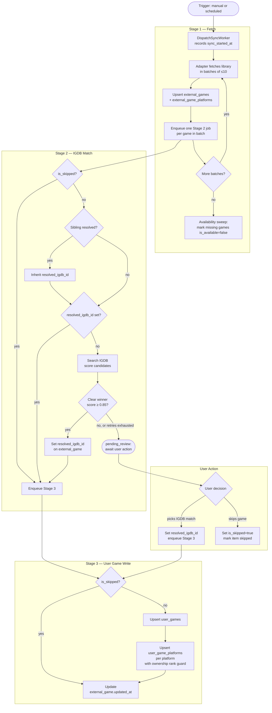
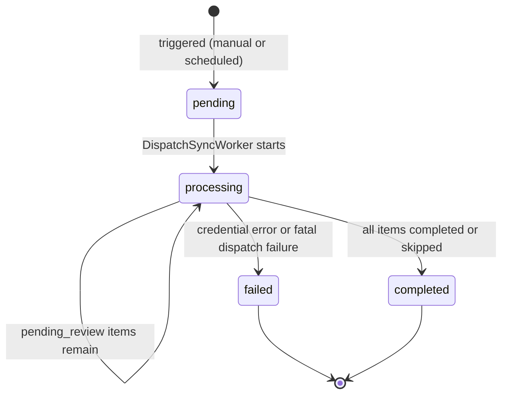

# Sync Process

This document is the source of truth for how Nexorious syncs a user's game library from an external storefront. It describes how the process **should** work. It is kept up to date as the process evolves and is intended for both humans and coding agents working on the sync system.

---

## Overview

Syncing imports a user's game library from an external storefront (Steam, PSN, GOG, or Epic Games Store) into Nexorious. The process fetches the library, matches each game to an entry in the IGDB game database, and creates or updates the user's Nexorious library accordingly.

The sync pipeline is designed to be:

- **Consistent** — the same general process applies to all storefronts; per-storefront differences are isolated to adapter code
- **Resilient** — transient failures are retried automatically; anything the process cannot resolve on its own — whether from an API failure or an ambiguous match — is routed to the user without blocking the rest of the sync
- **Non-destructive** — ownership and playtime are never downgraded; existing data is only improved

---

## Glossary

| Term | Meaning |
|---|---|
| **Storefront** | An external game store: Steam, PSN, GOG, or Epic Games Store |
| **ExternalGame** | A game record fetched from a storefront; persisted across sync runs |
| **ExternalGamePlatform** | A platform slug (e.g. `pc-windows`, `playstation-5`) that an ExternalGame is available on |
| **Job** | A sync run for one user and one storefront; tracks overall progress and status |
| **JobItem** | One game within a Job; tracks per-game matching progress |
| **IGDB** | The canonical game database used to identify and deduplicate games across storefronts |
| **pending_review** | A JobItem state where the user must manually pick an IGDB match or skip the game |
| **Ownership rank** | A hierarchy that prevents ownership downgrades: `owned` > `borrowed` / `rented` > `subscription` > `no_longer_owned` |

---

## Data Model

The sync system reads and writes these core tables:

| Table | Role |
|---|---|
| `user_sync_configs` | Credentials, sync frequency, and last sync timestamp per user and storefront |
| `external_games` | One row per user + storefront + game; persists across sync runs |
| `external_game_platforms` | Platform slugs and per-platform playtime for each ExternalGame |
| `jobs` | One row per sync run; tracks status and lifecycle |
| `job_items` | One row per game per sync run; tracks matching progress |
| `sync_changes` | Changelog entries written by Stage 1 and Stage 3; backs the Sync History UI |
| `games` | IGDB master catalogue; new rows are inserted when a match is found |
| `user_games` | The user's canonical library; one row per user + IGDB game |
| `user_game_platforms` | One row per user + game + platform + storefront combination |

### Key relationships

`user_games` holds one row per user per IGDB game, regardless of how many storefronts or platforms the game was found on. Each `user_game_platforms` row points back to the specific `external_games` row that created it via `external_game_id`. This means a single `user_games` row can have multiple `user_game_platforms` rows pointing to different `external_games` rows — which is expected and correct for storefronts that create multiple ExternalGame rows for the same game.

For example, PSN creates one ExternalGame row per title ID. The PS4 and PS5 versions of the same game are separate title IDs, so they produce separate ExternalGame rows and separate `user_game_platforms` rows — but both point to the same `user_games` row.

### Playtime

Playtime is stored at the `external_game_platforms` level (`hours_played`). Stage 1 writes the correct value to each platform row as part of the upsert; Stage 3 reads from there when writing to `user_game_platforms`. The total playtime for a game in the user's library is the sum of `hours_played` across all its `user_game_platforms` rows.

Not all storefronts provide playtime. When a storefront does not provide playtime, `hours_played` is 0 for all platform rows. Playtime is never decreased — a `user_game_platforms` row's `hours_played` is only updated when the incoming value is greater than the stored value.

### Sync Changes

`sync_changes` records what happened to a user's library during each sync run. Each row captures one event:

| Column | Type | Notes |
|---|---|---|
| `id` | TEXT | Primary key |
| `job_id` | TEXT | The sync job that produced this change; FK to `jobs` |
| `user_id` | TEXT | FK to `users` |
| `external_game_id` | TEXT | FK to `external_games`; nullable (SET NULL on delete) |
| `change_type` | TEXT | `added`, `removed`, or `status_changed` |
| `title` | TEXT | Game title at the time of the event; denormalised for display |
| `old_status` | TEXT | Previous ownership status; only set for `status_changed` |
| `new_status` | TEXT | New ownership status; only set for `status_changed` |
| `created_at` | TIMESTAMPTZ | When the event was recorded |

Writers:
- **Stage 1** writes a `removed` entry for each game marked `is_available = false` during the availability sweep
- **Stage 3** writes an `added` entry when a new `user_games` row is inserted, and a `status_changed` entry when the ownership rank guard replaces an existing status

Old entries are pruned by a periodic maintenance job (see Maintenance).

---

## Architecture

The sync pipeline has three stages. Each stage is implemented as a River worker job in the `tasks` package. The `DispatchSyncWorker` defines a standard adapter interface; each storefront implements that interface in its own `services/` package (`services/steam`, `services/psn`, `services/gog`, `services/epic`). Storefront-specific knowledge — auth, API communication, credential lifecycle — never crosses into the workers.



### DispatchSyncWorker responsibilities

- Recording `sync_started_at` at the beginning of a sync run
- Calling the adapter's batch callback and iterating until the library is fully fetched
- Applying rate limiting between API calls
- Upserting `external_games` and `external_game_platforms` after each batch
- Enqueuing Stage 2 jobs after each batch
- Running the availability sweep at the end of the fetch phase
- Failing the job and cancelling pending items on credential errors

### Storefront adapter responsibilities

Each adapter lives in its own `services/` package and is responsible for:

- All authentication mechanics (token refresh, CLI state management, credential expiry detection)
- Signalling credential errors to the worker
- Yielding games in batches of ≤10 via a callback

### Adapter interface

The `tasks` package defines a concrete Go interface (`StorefrontAdapter`) that every storefront adapter must implement. Each `services/` package implements this interface; the `DispatchSyncWorker` depends only on the interface, never on a concrete adapter type.

The interface requires a `GetLibrary` method that accepts a context, a batch size, and a callback. The adapter calls the callback once per batch of ≤10 games, each represented by a `GameEntry` value with the following fields:

| Field | Type | Notes |
|---|---|---|
| `ExternalID` | string | Storefront-specific game identifier |
| `Title` | string | Game name as reported by the storefront |
| `PlaytimeHours` | int | Hours played; 0 means not provided by this storefront |
| `Platforms` | []string | Platform names in storefront-specific format; resolved to canonical slugs by the worker |
| `OwnershipStatus` | string | `owned`, `subscription`, etc. |
| `IsSubscription` | bool | True if the game is accessed via a subscription service |

---

## Stage 1 — Fetch

The `DispatchSyncWorker` runs once per sync job. It:

1. Records `sync_started_at`
2. Calls the storefront adapter which fetches the library and yields games in batches of ≤10
3. After each batch:
   - Upserts each game into `external_games`, always setting `updated_at = now()` and `is_available = true`
   - Accumulates each game's `external_id` into an in-memory set of fetched IDs
   - Upserts platform rows into `external_game_platforms`; removes any platform rows for that game that were not in this batch
   - Enqueues one Stage 2 job per game in the batch
4. After all batches complete, runs a sweep: queries all `external_games` rows for this user and storefront where `is_available = true`, and marks any whose `external_id` is not in the fetched ID set as `is_available = false` — these are games that were not seen in this sync run and have been removed from the user's library. For each game marked unavailable, writes a `removed` entry to `sync_changes`

If a credential error occurs at any point, the job is marked `failed` and all pending job_items are cancelled. Any `external_games` rows already upserted in this run are kept.

---

## Stage 2 — IGDB Match

One `IGDBMatchWorker` job runs per game. River handles retries with exponential backoff for transient IGDB API failures.

1. **Skipped?** If `is_skipped` is true, route directly to Stage 3 — no matching is ever performed for skipped games
2. **Sibling check:** Look for another `external_games` row for the same user, storefront, and title that already has `resolved_igdb_id` set. If found, inherit its `resolved_igdb_id`. This avoids an unnecessary IGDB search when a related entry has already been matched
3. **Already resolved?** If `resolved_igdb_id` is now set — either from a previous sync run or just inherited from a sibling — route directly to Stage 3. On subsequent syncs, most games will take this path
4. **Search IGDB** for the game title; score each candidate using fuzzy title matching
5. **Auto-resolve** if the best candidate scores ≥ 0.85 and has a clear margin (> 0.01) over the second-best: set `resolved_igdb_id` on the `external_game` and enqueue Stage 3
6. **pending_review** if no clear winner is found, or if IGDB API calls fail after all River retries are exhausted: mark the item `pending_review` for the user to resolve

### Title matching

Before searching, titles are normalised (trademark symbols removed, diacritics folded, common suffixes like "GOTY" expanded, etc.). Candidates are scored using a weighted combination of fuzzy matching algorithms. The auto-resolve threshold is 0.85 with a tie-breaking margin of 0.01.

### Siblings

A sibling is another `external_games` row for the same user, storefront, and title. This occurs on storefronts that assign separate identifiers to different platform releases of the same game — for example, PSN assigns distinct title IDs to the PS4 and PS5 versions of a game.

The sibling mechanic prevents the same game from requiring repeated manual resolution. It operates in two places:

- **Stage 2 (pull):** before searching IGDB, check whether a sibling is already resolved and inherit its match
- **Manual match (push):** when the user resolves a `pending_review` item, any unresolved siblings with the same title are resolved with the same IGDB ID and a Stage 3 job is enqueued for each

The timing of Stage 2 processing means one sibling may land in `pending_review` before the other has been resolved. In that case the push mechanic ensures that resolving one automatically resolves the other.

---

## Stage 3 — User Game Write

One `UserGameWorker` job runs per game, enqueued by Stage 2 or by a user action.

1. If `is_skipped` is true: skip steps 2, 3, and 4
2. If `external_game.resolved_igdb_id` is not already set (i.e. Stage 3 was triggered by a manual user resolution, not auto-resolve), propagate `job_item.resolved_igdb_id` to `external_game.resolved_igdb_id` — this durably records the match for future sync runs
3. Upsert `user_games`: one row per user + IGDB game ID. If this is an INSERT (new game), write an `added` entry to `sync_changes`
4. For each platform row in `external_game_platforms`:
   - Upsert `user_game_platforms` with conflict key `(user_game_id, platform, storefront)`
   - On conflict: apply the ownership rank guard (never downgrade ownership status); update `hours_played` only if the incoming value from `external_game_platforms.hours_played` is greater; if the ownership status changed, write a `status_changed` entry to `sync_changes`
   - Set `external_game_id` to the specific ExternalGame row that produced this platform entry
5. Update `external_game.updated_at` — always, whether the game was skipped or not

### Ownership rank guard

Ownership statuses have a fixed rank. A stored status is never replaced by one of lower rank:

```
owned  >  borrowed / rented  >  subscription  >  no_longer_owned
```

---

## Job Lifecycle



A job is complete only when every job_item is either `completed` or `skipped`. Items in `pending_review` hold the job in `processing` indefinitely — the job does not time out waiting for the user.

### Job item statuses

| Status | Meaning |
|---|---|
| `pending` | Waiting to be picked up by a Stage 2 or Stage 3 worker |
| `processing` | Currently being worked on |
| `completed` | Successfully written to the user's library |
| `skipped` | Game is marked `is_skipped`; no user_game entry was created |
| `pending_review` | Awaiting the user to pick an IGDB match or skip the game |
| `cancelled` | Job failed mid-run; this item will not be processed |
| `failed` | Permanent failure (e.g. the external_game record is missing) |

---

## User Interactions

### Resolving a pending_review item

The user searches IGDB and selects a match. Once a match is chosen, the resolve endpoint sets `resolved_igdb_id` on the `job_item` and enqueues a Stage 3 job immediately. Stage 3 then propagates `resolved_igdb_id` from the `job_item` to the `external_game` as its first write step — the `external_game` is not updated at the time of the user's action, only when Stage 3 runs. Any unresolved siblings (same user, storefront, and title) are resolved with the same IGDB ID and also enqueued for Stage 3 at the time of the user's action.

### Skipping a game

The user marks a game as ignored. `is_skipped` is set to `true` on the `external_game` and the job_item is marked `skipped`. No Stage 3 job is created. On future syncs, Stage 2 routes the game directly to Stage 3, which updates `external_game.updated_at` and does nothing else.

### Unskipping a game

The user removes the skip. `is_skipped` is cleared. A new job_item is created and a Stage 2 job is enqueued immediately to begin IGDB matching.

### Rematching a game

The user replaces an existing IGDB match with a different one. `external_game.resolved_igdb_id` is updated and a Stage 3 job is enqueued immediately to update the user_game and platform associations.

---

## Credential Errors

All storefronts expose credential problems through a unified `credentials_error` flag in their status response. Each storefront detects errors differently, but all surface them the same way to the worker:

| Storefront | Detection mechanism |
|---|---|
| **Steam** | Decryption failure of `storefront_credentials`, or API key rejected by the Steam API |
| **PSN** | Authentication failure when exchanging the NPSSO token for an access token (token expires approximately every 2 months) |
| **GOG** | OAuth2 refresh token failure (refresh token expired or revoked) |
| **Epic** | Decryption failure of `storefront_credentials`, or Legendary CLI reports an authentication failure |

When a credential error occurs mid-sync, the job is marked `failed` and all pending job_items are cancelled. The user must reconfigure their credentials before triggering a new sync.

Credentials are stored encrypted at rest in `user_sync_configs.storefront_credentials`. Decryption happens in memory during Stage 1 only; plaintext is never persisted. On decryption failure, the encrypted bytes are left untouched in the database — they are never cleared.

---

## Scheduled Sync

A periodic worker checks `user_sync_configs` for all users where the sync frequency is not `manual` and the last sync was more than the configured interval ago (hourly / daily / weekly). For each, it creates a Job and enqueues a Stage 1 run — provided no active job already exists for that user and storefront. All four storefronts support scheduled sync.

---

## Maintenance

A periodic maintenance worker prunes `sync_changes` entries older than the retention period configured by `SYNC_HISTORY_RETENTION_DAYS` (default: 90 days). This keeps the table from growing unboundedly while preserving recent history for the Sync History UI.

---

## Storefront Adapters

All adapters implement the same interface. The differences below are the only places where storefront-specific knowledge lives.

### Steam

- **Auth:** API key + Steam ID; static credentials, no refresh needed
- **Library fetch:** A single API call returns the full library. The adapter then makes one AppDetails API call per game to resolve platform availability, and chunks the enriched results into batches of ≤10 before yielding them via the callback. The batching is adapter-side; the Steam API itself is not paginated
- **Rate limiting:** A token bucket enforces a minimum delay between AppDetails calls. On a 429 response, the adapter backs off and retries. Rate limiting is handled consistently with the shared library's backoff interface
- **Platforms:** `pc-windows`, `mac`, `pc-linux` as reported by AppDetails; all supported platforms are recorded as separate `external_game_platforms` rows
- **Playtime:** Provided as a single total across all platforms. The adapter assigns this value to the `hours_played` of the highest-priority platform row in the order `pc-windows` → `mac` → `pc-linux`; all other platform rows for the same game receive 0

### PSN

- **Auth:** NPSSO token exchanged for an access token; token expiry is detected and surfaced as a credential error
- **Library fetch:** Paginated API; the adapter re-chunks pages into batches of ≤10 for the callback
- **Rate limiting:** No published hard limit; the adapter applies a conservative request delay between pages
- **Platforms:** Derived from the `category` field in the API response — `ps4_game` maps to `playstation-4`, `ps5_native_game` maps to `playstation-5`. PSN creates one ExternalGame row per title ID, so the PS4 and PS5 versions of the same game appear as two separate ExternalGame rows, each with their own platform and playtime
- **Playtime:** Provided per title ID as an ISO 8601 duration string, parsed to hours

### GOG

- **Auth:** OAuth2; the adapter refreshes the access token using the stored refresh token before each fetch and saves the new tokens back to `user_sync_configs`
- **Library fetch:** Paginated API; the adapter re-chunks pages into batches of ≤10
- **Rate limiting:** Conservative request delay between pages
- **Platforms:** Reported per entry; mapped to canonical slugs
- **Playtime:** Not provided by the GOG API; always 0

### Epic Games Store

- **Prerequisites:** Requires the `LEGENDARY_WORK_DIR` environment variable to be set to a writable directory. If unset, Epic sync is disabled entirely — the adapter returns an error immediately and the storefront is unavailable in the UI
- **Auth:** Managed by the Legendary CLI. The adapter restores an encrypted session state snapshot from `user_sync_configs.storefront_credentials` to disk, runs the CLI, then captures and re-encrypts the updated snapshot back to `storefront_credentials`
- **Library fetch:** `legendary list --json`; DLC entries are filtered out (identified by a non-empty `MainGameAppName`); the adapter chunks the output into batches of ≤10
- **Rate limiting:** Handled internally by the Legendary CLI
- **Platforms:** Epic does not expose per-game platform data; all entries are `pc-windows`
- **Playtime:** Not provided; always 0

---

## User Interface

The sync UI has two levels: a hub page that shows all storefronts at a glance, and a per-storefront detail page where the user can configure, monitor, and act on sync results.

### Navigation

The global navigation shows an aggregate count of `pending_review` items across all storefronts. Tapping it navigates to the sync hub page.

### Sync Hub Page

A grid of storefront cards — one per supported storefront. Each card shows:

- Platform name and icon; the name links to that storefront's detail page
- Connection status (Connected / Credentials Error / Not Configured)
- Last synced timestamp
- Count of external games currently available on that storefront (`is_available = true`), including skipped games; shown as a simple number (e.g. "482 games")
- Pending review count badge; clicking it navigates to that storefront's detail page, anchoring to the Needs Review section where possible
- A Sync Now button to trigger a manual sync without navigating into the detail page

### Platform Detail Page

#### Header

The storefront name and a connection status badge. The badge is one of: **Connected**, **Credentials Error**, or **Not Configured**. Clicking the badge toggles the Connection & Settings section open or closed.

#### Connection & Settings Section

Collapsible. Collapsed by default when the connection is working; expanded by default when the status is Credentials Error or Not Configured.

Contains:
- Storefront-specific credential input (e.g. API key for Steam, NPSSO token for PSN, OAuth flow for GOG and Epic)
- Sync frequency setting (Manual / Hourly / Daily / Weekly)
- Disconnect action

#### Progress Box

Shown only while a sync job is active. Displays:

- Total number of games found on the storefront so far; during Stage 1 this count grows as games are fetched; once Stage 1 completes it is fixed for that run
- Live counts per state: matched, needs review, skipped, failed, and still processing

When the job reaches a terminal state the progress box collapses to a single summary line showing the outcome and timestamp, or disappears entirely.

Games that are currently in-flight (being processed by Stage 2 or Stage 3) do not appear in the External Games section — only the counts in the progress box reflect their existence until they settle into a stable state.

#### External Games Section

A permanent view of all external games for this storefront, organised into four groups. Only games in stable states are shown here.

| Group | Condition | Default | Actions |
|---|---|---|---|
| **Needs Review** | `pending_review` job item | Expanded | Pick IGDB match, Skip |
| **Failed** | Permanent Stage 2 or Stage 3 failure | Expanded | Retry (per game), Retry All |
| **Matched** | `resolved_igdb_id` set, Stage 3 complete | Collapsed | Change match |
| **Skipped** | `is_skipped = true` | Collapsed | Unskip |

The Needs Review group is the most prominent — these games are blocking the job from completing and require user action.

#### Sync History

A log of past sync runs for this storefront. Each entry shows:

- Timestamp and outcome (`completed` or `failed`)
- A summary: counts of games added, removed, and status-changed for that run
- An expandable changelog: the individual game titles behind those counts, grouped by change type (added, removed, status changed)

The changelog is collapsed by default — the summary counts are visible immediately. Expanding reveals the per-game detail. The history does not reproduce the full per-game processing trace — it is a human-readable record of what changed in the user's library as a result of each sync run.
