# Dependency Graph & Task Relationships
## Game Collection Management Service

### Overview
This document outlines the critical dependencies between major project tasks, identifies the critical path, and highlights opportunities for parallel development.

---

## Critical Path Analysis

### **Critical Path (Sequential Dependencies)**
```
Enhanced Foundation → Authentication + RBAC → Enhanced Database → Enhanced Game Management → Collection Management → Advanced Frontend → Production Deployment
```

**Estimated Duration**: 16-17 weeks (critical path)  
**Total Project Buffer**: 4-5 weeks for parallel development and risk mitigation  
**Updated**: Includes testing framework, comprehensive database schema, and role-based access control

---

## Dependency Graph Visualization

```mermaid
graph TD
    %% Foundation Layer
    A[Infrastructure Setup] --> B[Database Architecture]
    A --> C[Backend Infrastructure]
    A --> D[Frontend Infrastructure]
    A --> E[DevOps Foundation]
    
    %% Authentication Layer
    B --> F[User System]
    C --> F
    F --> G[Security & Authorization]
    
    %% Core Game Management
    B --> H[Game Data Model]
    G --> H
    H --> I[External Data Integration]
    H --> J[Platform Management]
    
    %% Collection Management
    I --> K[Collection System]
    J --> K
    F --> K
    K --> L[Progress Tracking]
    K --> M[Rating & Tagging]
    
    %% Data Integration
    I --> N[Import Systems]
    K --> N
    N --> O[Export Systems]
    
    %% User Interface
    D --> P[Core Interface]
    K --> P
    L --> P
    M --> P
    P --> Q[Advanced Features]
    P --> R[Responsive Design]
    
    %% Production Systems
    E --> S[Containerization]
    S --> T[Production Operations]
    T --> U[Monitoring & Logging]
    
    %% Quality Assurance
    P --> V[Testing Framework]
    V --> W[Quality Assurance]
    
    %% Documentation
    W --> X[Technical Documentation]
    W --> Y[User Documentation]
    
    %% Sprint Classifications
    classDef sprint0 fill:#ff6b6b,stroke:#333,stroke-width:2px
    classDef sprint1 fill:#4ecdc4,stroke:#333,stroke-width:2px
    classDef sprint2 fill:#45b7d1,stroke:#333,stroke-width:2px
    classDef sprint3 fill:#f9ca24,stroke:#333,stroke-width:2px
    classDef sprint4 fill:#f0932b,stroke:#333,stroke-width:2px
    classDef sprint5 fill:#eb4d4b,stroke:#333,stroke-width:2px
    classDef sprint6 fill:#6c5ce7,stroke:#333,stroke-width:2px
    classDef sprint7 fill:#a29bfe,stroke:#333,stroke-width:2px
    classDef sprint8 fill:#2d3436,stroke:#333,stroke-width:2px
    
    class A,B,C,D,E sprint0
    class F,G sprint1
    class H,I,J sprint2
    class K,L,M sprint3
    class N,O,P sprint4
    class Q,R sprint5
    class S,T,U sprint6
    class V,W sprint7
    class X,Y sprint8
```



---

## Detailed Task Dependencies

### **Sprint 0: Enhanced Foundation (Extended Duration)**
- **Infrastructure Setup**: Independent parallel work
- **Database Architecture**: Independent, but required for all data operations
- **Complete Database Schema**: Depends on basic database architecture
- **Testing Framework**: Independent, but required for all feature development
- **Backend Infrastructure**: Independent, but required for all API work
- **Frontend Infrastructure**: Independent, but required for all UI work
- **DevOps Foundation**: Independent, can be developed alongside features

### **Sprint 1: Authentication & Enhanced Security Systems**
```
Dependencies:
- Complete Database Schema (Sprint 0) → User System
- Backend Infrastructure (Sprint 0) → User System
- User System → Security & Authorization
- Security & Authorization → Role-Based Access Control
- Testing Framework (Sprint 0) → All authentication components
```

**Parallel Development Opportunities**:
- Frontend authentication components can be developed against API specifications
- Security middleware can be developed alongside user system
- Role-based access control can be developed after basic authentication is established

### **Sprint 2: Enhanced Game Management**
```
Dependencies:
- Complete Database Schema (Sprint 0) → Game Data Model
- Role-Based Access Control (Sprint 1) → Game Data Model
- Game Data Model → Enhanced IGDB Integration (8-step workflow)
- Game Data Model → Platform Management (admin-only)
- Enhanced IGDB Integration → Advanced Game Search UI
- Testing Framework (Sprint 0) → All game management components
```

**Parallel Development Opportunities**:
- Enhanced IGDB integration can be developed alongside game models
- Platform management can be developed in parallel with game models
- Frontend game search UI can be built against enhanced API specifications
- Admin-only platform management requires role-based access control

### **Sprint 3: Collection Management**
```
Dependencies:
- External Data Integration (Sprint 2) → Collection System
- Platform Management (Sprint 2) → Collection System
- User System (Sprint 1) → Collection System
- Collection System → Progress Tracking
- Collection System → Rating & Tagging
```

**Parallel Development Opportunities**:
- Progress tracking and rating systems can be developed simultaneously
- Frontend collection interfaces can be built against API specifications

### **Sprint 4: Data Integration & Core UI**
```
Dependencies:
- External Data Integration (Sprint 2) → Import Systems
- Collection System (Sprint 3) → Import Systems
- Import Systems → Export Systems
- Frontend Infrastructure (Sprint 0) → Core Interface
- Collection System (Sprint 3) → Core Interface
- Progress Tracking (Sprint 3) → Core Interface
- Rating & Tagging (Sprint 3) → Core Interface
```

**Parallel Development Opportunities**:
- Import/export systems can be developed while UI is being built
- Steam integration can be developed independently

### **Sprint 5: Advanced Features**
```
Dependencies:
- Core Interface (Sprint 4) → Advanced Features
- Core Interface (Sprint 4) → Responsive Design
```

**Parallel Development Opportunities**:
- Advanced search features can be developed alongside mobile optimization
- Statistics features can be developed independently

### **Sprint 6: Production Infrastructure**
```
Dependencies:
- DevOps Foundation (Sprint 0) → Containerization
- Containerization → Production Operations
- Production Operations → Monitoring & Logging
```

**Parallel Development Opportunities**:
- Kubernetes configurations can be developed alongside Docker containers
- Monitoring systems can be configured while deployment is being set up

### **Sprint 7: Quality Assurance**
```
Dependencies:
- Core Interface (Sprint 4) → Testing Framework
- Testing Framework → Quality Assurance
```

**Parallel Development Opportunities**:
- Unit tests can be written alongside feature development
- Integration tests can be developed while UI testing is being implemented

### **Sprint 8: Documentation & Launch**
```
Dependencies:
- Quality Assurance (Sprint 7) → Technical Documentation
- Quality Assurance (Sprint 7) → User Documentation
```

**Parallel Development Opportunities**:
- Technical and user documentation can be developed simultaneously
- Video tutorials can be created while written documentation is being finalized

---

## Risk Dependencies

### **High-Risk Dependencies**
1. **IGDB API Integration** (Sprint 2)
   - **Risk**: Rate limiting or API changes
   - **Impact**: Affects game metadata retrieval
   - **Mitigation**: Implement caching, fallback data sources

2. **Authentication System** (Sprint 1)
   - **Risk**: Security vulnerabilities
   - **Impact**: Blocks all user-specific features
   - **Mitigation**: Security review, penetration testing

3. **Database Schema** (Sprint 0-1)
   - **Risk**: Schema changes requiring migration
   - **Impact**: Affects all data operations
   - **Mitigation**: Careful schema design, migration testing

### **Medium-Risk Dependencies**
1. **Steam API Integration** (Sprint 4)
   - **Risk**: Authentication flow issues
   - **Impact**: Import functionality limited
   - **Mitigation**: Alternative import methods

2. **Frontend Framework** (Sprint 0)
   - **Risk**: SvelteKit compatibility issues
   - **Impact**: All UI development
   - **Mitigation**: Framework evaluation, fallback options

### **Low-Risk Dependencies**
1. **Docker Configuration** (Sprint 0, 6)
   - **Risk**: Container deployment issues
   - **Impact**: Deployment complexity
   - **Mitigation**: Alternative deployment methods

2. **Kubernetes Setup** (Sprint 6)
   - **Risk**: Cluster configuration issues
   - **Impact**: Scaling limitations
   - **Mitigation**: Docker Compose fallback

---

## Parallel Development Strategy

### **Team Structure for Parallel Development**

#### **Team A: Backend/API Development**
- **Sprint 0**: Backend infrastructure, database setup
- **Sprint 1**: Authentication system, user management
- **Sprint 2**: Game management APIs, IGDB integration
- **Sprint 3**: Collection management APIs
- **Sprint 4**: Import/export systems
- **Sprint 5**: Advanced API features
- **Sprint 6**: Production backend deployment
- **Sprint 7**: Backend testing and optimization
- **Sprint 8**: API documentation

#### **Team B: Frontend Development**
- **Sprint 0**: Frontend infrastructure, design system
- **Sprint 1**: Authentication UI (against API specs)
- **Sprint 2**: Game library interface mockups
- **Sprint 3**: Collection management UI
- **Sprint 4**: Core interface integration
- **Sprint 5**: Advanced features, mobile optimization
- **Sprint 6**: PWA implementation
- **Sprint 7**: Frontend testing and polish
- **Sprint 8**: User documentation

#### **Team C: DevOps/Infrastructure**
- **Sprint 0**: Docker development environment
- **Sprint 1**: CI/CD pipeline setup
- **Sprint 2**: Testing environment setup
- **Sprint 3**: Staging environment
- **Sprint 4**: Production infrastructure planning
- **Sprint 5**: Monitoring and logging setup
- **Sprint 6**: Kubernetes deployment
- **Sprint 7**: Security hardening
- **Sprint 8**: Production deployment documentation

### **Integration Points**
- **Weekly**: API contract reviews between frontend and backend teams
- **Sprint End**: Full integration testing with all teams
- **Mid-Sprint**: DevOps team deploys latest builds to testing environments

---

## Critical Path Optimization

### **Path Compression Opportunities**
1. **Testing Framework + Infrastructure** (Sprint 0)
   - Testing framework can be developed in parallel with infrastructure setup
   - Database schema work can overlap with basic database setup
   - Reduces critical path by 0.5 weeks

2. **Authentication + Role-Based Access Control** (Sprint 1)
   - RBAC can be developed after basic authentication is established
   - Can be developed in parallel with different team members
   - Reduces critical path by 0.5 weeks

3. **Enhanced IGDB + Game UI** (Sprint 2)
   - Frontend game search UI can be built against API specifications
   - Platform management can be developed in parallel
   - Reduces critical path by 1 week

4. **Collection Features** (Sprint 3)
   - Progress tracking and rating can be developed simultaneously
   - Reduces critical path by 1 week

### **Total Critical Path Reduction**: 3 weeks
**Optimized Critical Path**: 13-14 weeks instead of 16-17 weeks
**Note**: Additional complexity from PRD requirements partially offset by improved parallel development

---

## Dependency Management Best Practices

### **1. API-First Development**
- Define API contracts before implementation
- Allow frontend and backend teams to work in parallel
- Mock services for integration testing

### **2. Feature Flags**
- Implement feature flags for gradual rollout
- Allow incomplete features to be deployed without blocking
- Enable A/B testing for new features

### **3. Database Migration Strategy**
- Design backward-compatible schema changes
- Test all migrations on staging data
- Implement rollback procedures

### **4. External Service Integration**
- Abstract external APIs behind service layers
- Implement circuit breakers for resilience
- Cache frequently accessed data

### **5. Enhanced Testing Strategy**
- Comprehensive testing framework established in Sprint 0
- Unit tests developed alongside features (>80% backend, >70% frontend coverage)
- Integration tests for critical paths and database operations
- End-to-end tests for user workflows with Playwright
- API contract testing for frontend/backend alignment
- Performance testing for critical operations
- Accessibility testing automation for WCAG compliance
- Visual regression testing for UI consistency

---

## Milestone Dependencies

### **Milestone 1: MVP Foundation (End of Sprint 1)**
**Dependencies Met**:
- Infrastructure setup complete
- User authentication working
- Database schema established
- API foundation operational

**Blocks if Not Met**:
- All subsequent feature development
- Team productivity severely impacted

### **Milestone 2: Core Features (End of Sprint 3)**
**Dependencies Met**:
- Game management system operational
- User collections working
- Basic progress tracking implemented
- IGDB integration functional

**Blocks if Not Met**:
- Frontend development limited
- Import systems cannot be tested
- User acceptance testing delayed

### **Milestone 3: User Interface (End of Sprint 4)**
**Dependencies Met**:
- Core interface functional
- Authentication UI working
- Collection management interface operational
- Basic import functionality working

**Blocks if Not Met**:
- User testing cannot begin
- Mobile optimization delayed
- Production deployment at risk

### **Milestone 4: Production Ready (End of Sprint 6)**
**Dependencies Met**:
- All core features implemented
- Mobile optimization complete
- Production infrastructure ready
- Monitoring and logging operational

**Blocks if Not Met**:
- Launch delayed
- User documentation incomplete
- Security review cannot be completed

---

## Risk Mitigation Timeline

### **Week 1-2 (Sprint 0)**
- Validate all technology choices
- Establish development environment
- Confirm external API access

### **Week 3-4 (Sprint 1)**
- Security review of authentication system
- Database performance testing
- API design review

### **Week 5-6 (Sprint 2)**
- IGDB integration testing
- Game data model validation
- Performance benchmarking

### **Week 7-8 (Sprint 3)**
- Collection system stress testing
- Progress tracking validation
- User workflow testing

### **Week 9-10 (Sprint 4)**
- Import system testing with real data
- UI/UX validation
- Cross-browser compatibility testing

### **Week 11-12 (Sprint 5)**
- Mobile device testing
- Performance optimization
- Accessibility compliance testing

### **Week 13-14 (Sprint 6)**
- Production deployment testing
- Security penetration testing
- Backup/restore validation

### **Week 15-16 (Sprint 7)**
- Load testing
- User acceptance testing
- Documentation review

### **Week 17-18 (Sprint 8)**
- Final security review
- Launch preparation
- Post-launch monitoring setup